# superRA

superRA turns AI coding agents into disciplined Research Assistants. Built as a fork of [Superpowers](https://github.com/obra/superpowers), it ships a complete **iterative** PLAN → IMPLEMENT → VALIDATE → INTEGRATE workflow that enforces reviewer sign-off at every step, keeps `PLAN.md` / `RESULTS.md` as the session-to-session source of truth, runs autonomously between legitimate stop points, and merges via intent-based semantic-merge rather than bare `git merge`. Research is rarely linear — new tasks surface mid-execution, PR reviewers request adjacent analyses, methodology pivots land post-integration — so the phases form a cycle. Today's flagship domain is economic data analysis; the architecture is built to extend to theory, literature review, simulation, and writing.

## Why superRA?

AI agents are fast but undisciplined. They jump to implementation before understanding the task, declare "looks fine" without verification, and merge without checking what changed. Research — empirical or otherwise — cannot absorb that failure mode.

superRA answers with four load-bearing workflow principles that apply to every domain:

1. **Implementer–reviewer pair at every step.** No result ships without adversarial review. One comprehensive review pass per task during execution (`APPROVE` / `REVISE`), drift-test + integration review before merge.
2. **Handoff docs are the auditable record.** Findings, decisions, methodology notes land in committed `PLAN.md` / `RESULTS.md` *before* they appear in any report. Any fresh agent resumes from docs + git alone.
3. **Fast early, strict before merge. Semantic merges always.** Interim tasks optimize for speed; integration discipline loads only when the user chooses to merge. Every merge into main is a semantic-merge.
4. **Autonomous with human in the loop.** The agent drives work forward on its own power, and stops — via `AskUserQuestion` — only for hard blockers, decisions beyond its authority, and user-defined workflow milestones.

In the **data-analysis vertical** (today's flagship), these principles are backed by one non-negotiable domain rule: **Iron Law — NO TRANSFORMATION WITHOUT PRIOR DESCRIPTION**. Every data operation is shaped by three concurrent disciplines: Describe, Analyze, and Validate. See `skills/econ-data-analysis/SKILL.md`.

## How It Works

When your agent receives a research task, it doesn't jump into code — it follows a four-phase macro workflow: **PLAN → IMPLEMENT → VALIDATE → INTEGRATE**. The phases are domain-agnostic; the domain skill supplies the discipline that applies inside each phase. The phases also **cycle**: a discovery during IMPLEMENT, a reviewer request during INTEGRATE, or a scope addition after merge all route back through `planning-workflow §Changing Plans`, which rolls back the affected milestones, walks the DAG to clear downstream per-task statuses, and resumes at the right re-entry point.

```
PLAN            planning-workflow (domain vertical setup → scope check → task decomposition)
                Route to the active domain skill's planning reference.
                  (data analysis: econ-data-analysis/references/planning.md — Data Inventory hard gate, sensitivity design)
                Break work into tasks. Output: PLAN.md + RESULTS.md (living handoff docs).
                    |
IMPLEMENT       execution-workflow (implementer agent per task)
                Apply domain discipline at every step.
                  (data analysis: Describe / Analyze / Validate — econ-data-analysis main body)
                Atomic commit per task: code + PLAN.md status + RESULTS.md findings.
                    |
VALIDATE        execution-workflow (reviewer agent after each task)
                One comprehensive review pass: the reviewer walks the domain skill's §Three Concurrent Disciplines
                top to bottom plus any §Pitfalls subsections matching operations performed. Returns APPROVE / REVISE.
                REVISE triggers a narrow re-review (cited fixes + dependent findings) until APPROVED.
                    |
INTEGRATE       integration-workflow (Phases A–D; invokes semantic-merge internally when integration reviewer calls for intent-based resolution)
                Phase A: drift tests for key results (data-analysis vertical).
                Phase B: iterative unified sync + refactor. Phase C: mature RESULTS.md + doc audit.
                Phase D: final local merge or PR + cleanup.
```

Each task produces an atomic commit. If the session dies at any point, the next session reads `PLAN.md` + `RESULTS.md` + git state and picks up exactly where the last one stopped — including mid-cycle re-entry after a scope change, because the unchecked `## Workflow Status` boxes and per-task `**Review status:**` / `**Integration status:**` fields encode exactly how far the last §Changing Plans pass rolled state back.

## Workflow Map

The diagram below shows how each skill, reference, and agent plugs into each workflow stage. Cross-cutting skills (`using-superRA`, `agent-orchestration`) apply at every dispatch and are shown as a shared rail at the bottom rather than repeated inside each stage node. `handoff-doc` is doc-discipline scoped — loaded by doc-creators in PLAN / INTEGRATE and on demand elsewhere; subagents get a compact etiquette from the agent files. The authoritative `Stage:` → skills + references mapping lives in `superRA:using-superRA` §Skill-Load Manifest; this diagram visualizes that same mapping, stage-by-stage.

```mermaid
flowchart TB
    SESSION["<b>Session start</b><br/>(every new/compacted session)"]
    SESSION --> PLAN

    PLAN["<b>PLAN</b><br/>planning-workflow<br/>+ econ-data-analysis/references/planning.md<br/>Data Inventory hard gate, sensitivity design"]
    PLAN --> IMPL

    IMPL["<b>IMPLEMENT</b> (per task)<br/>execution-workflow Step 2<br/>Stage: implementation<br/>→ implementer agent<br/>+ econ-data-analysis main body (Iron Law, Describe/Analyze/Validate)<br/>+ econ-data-analysis/references/notebook-format.md"]
    IMPL --> VAL

    VAL["<b>VALIDATE</b> (per task)<br/>execution-workflow Step 2 review<br/>Stage: implementation (subagent_type encodes role)<br/>→ reviewer agent<br/>+ econ-data-analysis §Three Concurrent Disciplines + §Pitfalls (conditional)<br/>APPROVE / REVISE"]
    VAL -->|REVISE loop| IMPL
    VAL -->|APPROVED, next task| IMPL
    VAL -->|all tasks APPROVED, user chooses merge| INT1

    INT1["<b>INTEGRATE — Phase A: drift tests</b><br/>integration-workflow Phase A<br/>Stage: drift-test<br/>→ implementer + reviewer<br/>+ refactor-and-integrate/references/drift-test-quality.md<br/>+ econ-data-analysis/references/integrate-drift-tests.md"]
    INT1 --> INT2

    INT2["<b>INTEGRATE — Phase B: review-led sync + refactor (iterative)</b><br/>integration-workflow Phase B<br/>Stage: integration (+ semantic-merge when reviewer calls for intent-based resolution)<br/>→ integration reviewer → implementer(s) → integration reviewer<br/>+ econ-data-analysis/references/integration.md (data-specific)<br/>+ refactor-and-integrate/references/codebase-integration.md (generic)<br/>+ refactor-and-integrate/references/merge-quality.md (conditional)"]
    INT2 --> INT3
    INT2 -->|re-enterable| INT2

    INT3["<b>INTEGRATE — Phase C: doc finalization</b><br/>integration-workflow Phase C<br/>Stage: documentation<br/>→ doc-writer + doc-reviewer<br/>+ report-in-markdown (baseline-io, rich-content, final-form)<br/>Mature RESULTS.md + PLAN.md disposition"]
    INT3 --> MERGE

    MERGE["<b>INTEGRATE — Phase D: final merge / PR / cleanup</b><br/>integration-workflow Phase D<br/>→ orchestrator (user-facing decisions)<br/>Pre-merge freshness check; if main advanced, re-enter Phase B<br/>Local merge or PR push; worktree cleanup"]
    MERGE -->|if main advanced| INT2

    CROSS["<b>Cross-cutting (every dispatch)</b><br/>using-superRA — universal principles · code-change defaults · skill inventory · skill-load manifest · execution modes (subagent/direct) · session bootstrap<br/>agent-orchestration — dispatch shape · return deltas · reviewer-feedback adjudication · review-status reference<br/>handoff-doc — loaded on demand or by doc-creators; carries four principles · inline-edit · task-block anatomy · user-decisions log · figure embedding"]

    SESSION -.loads.-> CROSS
    PLAN -.uses.-> CROSS
    IMPL -.uses.-> CROSS
    VAL -.uses.-> CROSS
    INT1 -.uses.-> CROSS
    INT2 -.uses.-> CROSS
    INT3 -.uses.-> CROSS
    MERGE -.uses.-> CROSS

    classDef phase fill:#eef7ff,stroke:#0366d6,stroke-width:1px,color:#000
    classDef cross fill:#fff9e6,stroke:#b58900,stroke-width:1px,color:#000
    classDef session fill:#f0f0f0,stroke:#666,color:#000
    class PLAN,IMPL,VAL,INT1,INT2,INT3,MERGE phase
    class CROSS cross
    class SESSION session
```



**Legend — the DRY-composition pattern.** `using-superRA` is the master skill every agent reads; it owns the universal principles, the code-change defaults, the skill inventory, the composable-design map, the Skill-Load Manifest, and the Execution Modes (subagent dispatch vs direct mode). Workflow skills own *choreography* — what steps run in what order at each stage. `agent-orchestration` owns cross-stage orchestration (dispatch shape, return-delta protocol, reviewer-feedback adjudication, review-status reference). Domain skills own domain discipline (Iron Law, Describe/Analyze/Validate, the `[BLOCKING]` / `[ADVISORY]` shared-flow checklists that both implementer and reviewer walk). `refactor-and-integrate` owns generic integration discipline (drift-test quality, codebase integration, merge quality). `handoff-doc` owns document-level discipline for `PLAN.md` / `RESULTS.md`. The Skill-Load Manifest in `superRA:using-superRA` is the authoritative map from a dispatched `Stage:` value to the exact skills and references the agent loads — the diagram above is a visualization of that manifest.

**Extension note.** Adding a new vertical (theory, literature review, simulation, writing) swaps only the Domain column — the planning reference, the main-body discipline, the §Three Concurrent Disciplines checklist, and the integration reference. The workflow skills, `agent-orchestration`, `handoff-doc`, `refactor-and-integrate`, and the agent Stage-table scaffolding all stay put. A new vertical composes these pieces; it never forks a workflow skill.

## Design Principles

Four workflow principles are baked into every skill in the repo. Every contribution is evaluated against them (see `CLAUDE.md` for the full version).

1. **Enforced implementer–reviewer pair at every step.** No result is accepted until a reviewer signs off. One comprehensive review pass per task during execution — the reviewer walks the active domain skill's §Three Concurrent Disciplines top to bottom (plus any §Pitfalls subsections matching operations performed) and returns `APPROVE` / `REVISE`. Drift-test and integration reviews before merge, and a fresh integration review after semantic-merge. Review is never skipped. The reviewer's role is adversarial — flag everything, err on the side of over-criticism. The orchestrator arbitrates with big-picture context, filtering through the reviewer's over-critical bias and overruling with documented reasoning when warranted.

2. **Handoff docs are the auditable record AND the continuation point.** All material findings, decisions, and results land in committed `PLAN.md` / `RESULTS.md` *before* they appear in any chat reply. Any fresh agent can resume work from the docs + git state alone — no prompt history required. Atomic commits bundle code + doc edits together.

3. **Fast early, strict before merge. Semantic merges always.** Analysis code is written for speed during implementation — no codebase-fit checks at interim checkpoints. Refactoring, drift tests, codebase integration, and documentation finalization (maturing RESULTS.md and auditing project docs) happen only when the user chooses to merge. Every merge into main runs through `semantic-merge`, never a bare `git merge` / `rebase` / `cherry-pick`.

4. **Autonomous with human in the loop.** The agent drives the workflow forward on its own between legitimate stop points — no "should I continue?" check-ins on approved plans. It stops, and uses `AskUserQuestion` when available, only for hard blockers, decisions beyond the RA's authority (methodology, scope, research intent), or user-defined milestones. Every user decision at a stop point is logged into `PLAN.md` before the agent acts on it.

### Architectural discipline

Below the four workflow principles sits one load-bearing architectural rule that shapes how the skills themselves compose.

**DRY, composability, extensibility.** One source of truth per concern. `using-superRA` is the master skill every agent reads — it owns the universal principles, code-change defaults, skill inventory, composable-design map, Skill-Load Manifest, and Execution Modes (subagent dispatch vs direct mode). Workflow skills own choreography (what steps run in what order). `agent-orchestration` owns cross-stage orchestration (dispatch shape, relay protocol, verdict adjudication). Domain skills own domain discipline. `refactor-and-integrate` owns generic integration discipline. `handoff-doc` owns handoff-doc mechanics. When adding content, ask *what concern does this describe?* and put it in the one skill that owns that concern; reference it from everywhere else. Duplicated content invites drift and is a code smell. Shared-flow corollary: for any gated checklist, implementer and reviewer walk the **same file**, with `[BLOCKING]` / `[ADVISORY]` markers encoding severity — one document, two perspectives. Adding a new vertical composes existing pieces; it never forks workflow skills. See `CLAUDE.md` §DRY, composability, extensibility for the full statement and ownership map.

## Installation

superRA is a fork of [Superpowers](https://github.com/obra/superpowers), adapted for economic research. Clone and install as a local plugin:

### Claude Code

```bash
git clone https://github.com/FuZhiyu/econ-superpowers.git
# Then add as a local plugin in your project's .claude/settings.json
```

### Other Platforms

See the upstream [Superpowers docs](https://github.com/obra/superpowers) for plugin installation patterns on Cursor, Codex, Copilot CLI, and Gemini CLI. Point them at this repo instead of the upstream.

## Skills

superRA's skills split into four categories. The directory layout stays flat (one `skills/<name>/SKILL.md` per skill); `skills/CATEGORIES.md` is the authoritative grouping index.

- **Workflow skills** — domain-agnostic choreography for each phase. What agent to dispatch, in what sequence, with what handoff rules. Reused across every domain vertical.
- **Domain skills** — vertical-specific discipline (today: data analysis). Loaded by workflow skills when a task touches the matching domain. Organized with stage-scoped references so only the relevant chunk loads per phase.
- **Utility skills** — reusable, domain-neutral tools. Handoff-doc discipline, report formatting, notebook rendering, worktree management, semantic merge, verification.
- **Meta skills** — session bootstrap and skill authoring.

### Workflow

| Skill | Phase | What It Does |
|-------|-------|-------------|
| **planning-workflow** | PLAN | Scope check, task decomposition, self-review, execution handoff. Points at the active domain skill for domain-specific gates and templates. |
| **execution-workflow** | IMPLEMENT + VALIDATE | Per-task dispatch, one-pass review loop (APPROVE / REVISE) with orchestrator-discipline filter, pipeline + reproducibility verification, 4-option completion menu. |
| **integration-workflow** | INTEGRATE (Phases A–D) | Phase A drift-test creation, Phase B review-led iterative sync+refactor (integration reviewer annotates; `semantic-merge` invoked when reviewer calls for intent-based resolution), Phase C doc finalization (mature RESULTS.md + audit project-level CLAUDE.md / AGENTS.md / README.md), Phase D final merge / PR / cleanup. Re-enterable Phase B on main advancement. |
| **agent-orchestration** | cross-cutting | Multi-agent dispatch patterns: workload balancing across tiers, parallel subagents for independent tasks, reviewer-feedback adjudication. |

### Domain — Data Analysis

| Skill | What It Does |
|-------|-------------|
| **econ-data-analysis** | Iron Law (no transformation without prior description). Three concurrent disciplines: Describe, Analyze, Validate (with sensitivity analysis as a first-class validation discipline). Diagnostics-for-validity philosophy. Pitfall catalogs for merges, time series, aggregations, filtering, variable construction, missing data. Common Rationalizations table. Stage-scoped references load per phase: `planning.md` (Data Inventory hard gate + sensitivity design), `integrate-drift-tests.md` (drift-test construction), `integration.md` (data-specific integration gates), `data-robustness-checklist.md` (robustness menu), `notebook-format.md` (cell organization + Python/Julia rendering; companion guides `jupytext-guide.md`, `julia-quarto-guide.md`). |

Future verticals — theory/modeling, literature review, simulation, writing/paper drafting — are planned; see the Roadmap section at the bottom.

### Utility

| Skill | What It Does |
|-------|-------------|
| **handoff-doc** | Handoff-doc discipline — four document principles, inline-edit rule, stale-content checklist, User Decisions Log format, figure-embedding pointer, full `PLAN.md` / `RESULTS.md` anatomy templates (`plan-anatomy.md`, `results-anatomy.md`). Loaded on demand when the compact etiquette in `agents/implementer.md` / `agents/reviewer.md` step 1 is not enough, and always by doc-creators (`planning-workflow` Phase 2, `integration-workflow` Step 3 doc-writer). Usable standalone by a single author with no subagents. |
| **refactor-and-integrate** | Three integration-phase checklists: `drift-test-quality.md`, `codebase-integration.md`, `merge-quality.md`. Standalone-invokable for any refactoring task. |
| **report-in-markdown** | Format discipline for markdown reports with figures, LaTeX math, tables. Lean SKILL.md body; three references loaded on demand: `baseline-io.md`, `rich-content.md`, `final-form.md`. |
| **semantic-merge** | Intent-based branch integration for any vertical or caller (human at terminal, orchestrator direct, or dispatched agent). Resolves conflicts by intent rather than mechanics; escalates research-meaningful decisions to the user. Invoked by `integration-workflow` Phase B when the integration reviewer calls for it, and usable standalone. |
| **worktree-data-sync** | Non-git data sync between existing worktrees (seed, diff, apply modes) and data teardown. Worktree lifecycle (create / enter / remove) lives in `agent-orchestration/references/worktree-harness-fallback.md`. |

### Meta

| Skill | What It Does |
|-------|-------------|
| **using-superRA** | Master skill every agent reads. Carries the distilled universal principles, code-change defaults, the Workflow / Domain / Utility / Meta skill inventory, the composable-design map, the seven-row Skill-Load Manifest (Stage → required skills + stage-scoped references), and the Execution Modes (subagent dispatch vs direct). Preloaded on `superRA:implementer` / `superRA:reviewer` agent frontmatter; injected at session start for the main agent. Main-agent-only cross-session detection and autonomy contract live in `references/main-agent.md`. |

## Agents

| Agent | Role |
|-------|------|
| **reviewer** | Prototype reviewer agent. Verifies work independently using APPROVE/REVISE protocol. Dispatched with a workflow skill and the active domain skill's stage reference. |
| **implementer** | Prototype implementer agent. Executes tasks under the active domain's discipline. Dispatched with a workflow skill and the active domain skill's stage reference. |

## Key Design Decisions

**Agent-owned doc updates.** Each agent commits its doc changes atomically with its work. The implementer commits code + PLAN.md status + RESULTS.md findings in a single commit. Reviewers commit review notes and APPROVED status separately. No orchestrator transcription step.

**Review status protocol.** Tasks in PLAN.md carry a status line: `IMPLEMENTED` (code done, awaiting review), `REVISE` (reviewer found `[BLOCKING]` issues to fix — a narrow re-review verifies cited fixes + any finding annotated as depending on an upstream fix, then promotes to APPROVED), `APPROVED` (review passed). A fresh session can tell exactly where each task stands.

**One comprehensive review pass.** The reviewer walks the active domain skill's §Three Concurrent Disciplines top to bottom — `[BLOCKING]` / `[ADVISORY]` items — plus any §Pitfalls subsections matching operations performed. Never halts on a failure. Reviewer dispatches are costly; halting early forces a full re-review. Findings that depend on an earlier fix are annotated in plain prose so the re-review can be narrow (verify cited fixes + dependent findings; everything else accepted from the first pass). Review is never skipped, even in direct execution mode. Implementer and reviewer walk the same checklist — one source of truth, no drift between pre-handoff self-check and reviewer verification.

**Stage → skill and reference loads via the Skill-Load Manifest.** `superRA:using-superRA` §Skill-Load Manifest is the single source of truth mapping each `Stage:` value (`implementation`, `integration`, `drift-test`, `merge`, `documentation`, `planning-review`) to the required skills and stage-scoped references agents load. Every agent reads `using-superRA`, so the manifest is always reachable. Dispatch prompts carry only Stage, task pointer, git range, and optional steering — the manifest handles the rest.

**Scope rule.** Agents only edit their own task's sections in PLAN.md and RESULTS.md. Never touch other tasks.

**RA framing.** The agent is a Research Assistant implementing the researcher's ideas, not judging methodology. It executes, validates, and escalates — but the researcher decides the approach.

**Lean agent definitions.** Two prototype agents (implementer, reviewer) define roles, not rules. Domain-specific checklists come from reference files read at dispatch time — today's flagship is `superRA:econ-data-analysis`, which agents load (plus the stage-appropriate reference) whenever the task touches data, per the `superRA:using-superRA` §Skill-Load Manifest. One source of truth per concern, easy to maintain, easy to extend to a new vertical.

## Hooks

| Hook | Trigger | Purpose |
|------|---------|---------|
| **merge-guard** | Before any `git merge/rebase/cherry-pick` | Remind to use semantic-merge skill |
| **ask-user-question-logger** | After `AskUserQuestion` | Remind to log the decision in PLAN.md before acting |
| **exit-plan-mode** | After `ExitPlanMode` | Remind to materialize plan into PLAN.md + RESULTS.md before implementing |

## Philosophy

**Workflow discipline (cross-cutting):**
- **Adversarial review at every step** — implementer and reviewer are separate roles; nothing ships without sign-off.
- **Docs are the record** — `PLAN.md` + `RESULTS.md` + git = complete handoff. Status reports point at the docs; they do not replace them.
- **Autonomous with human in the loop** — the agent drives forward on its own power and stops only at legitimate decision points.
- **Semantic merges always** — every merge into main goes through intent-based conflict resolution, never a bare `git merge`.

**Data-analysis vertical (today's flagship):**
- **Data-first** — Understand before transforming. Always. (Iron Law.)
- **Diagnostics are the primary validity signal** — not a chore, the main tool for judging whether a result is trustworthy.
- **Reproducibility is a requirement** — drift tests, pipeline files, committed code. Not optional.

**Across every vertical:**
- **Researcher decides, agent implements** — methodology is not the agent's call.

## Roadmap: Extending Beyond Data Analysis

superRA's workflow scaffolding is domain-agnostic by design. Adding a new vertical means adding a domain skill (with stage-scoped references), not forking the workflow. The four workflow principles, the implementer–reviewer pair, handoff-doc mechanics, and semantic-merge all carry over unchanged.

Planned verticals (hooks for future work, not commitments):

- **Theory / modeling.** Derivation discipline, notation consistency, proof checks, numerical verification of derived formulas.
- **Literature review.** Citation integrity, claim-evidence mapping, coverage audits, systematic note-taking formats.
- **Simulation.** Seed discipline, stochastic reproducibility, parameter-grid sensitivity, convergence diagnostics.
- **Writing / paper drafting.** Figure/table consistency with the underlying code, cross-reference integrity, narrative coherence, manuscript versioning alongside the analysis branch.

See `CLAUDE.md` §Roadmap for the checklist to add a new vertical.

## Upstream

superRA is a fork of [Superpowers](https://github.com/obra/superpowers) by [Jesse Vincent](https://blog.fsck.com). The upstream project provides the plugin infrastructure, skill system, and several general-purpose skills that superRA inherits and extends.

## License

MIT License — see LICENSE file for details.
