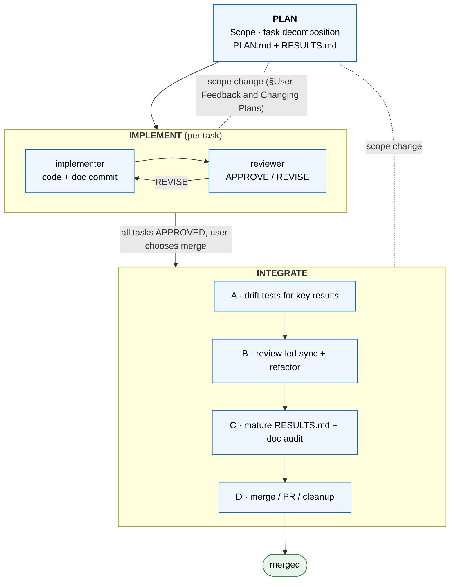

# superRA

superRA turns AI coding agents into disciplined Research Assistants. It ships:

1. An adaptive **plan-implement-integrate workflow** that enforces reviewer sign-off at every step and keeps results reproducible long-term.
2. **Domain skills** that teach agents how to do research work properly — starting with economic data analysis; theory, writing, and modeling are on the roadmap.
3. **Utility skills** for technical reports in markdown, gated integration checklists, semantic branch merges, and data sync across git worktrees.

superRA is inspired by the [Superpowers](https://github.com/obra/superpowers) plugin, which centers on test-driven development. superRA adapts the same spine to scientific research, which is exploratory, iterative, and fluid.

## Why superRA?

AI agents are fast but undisciplined:

- Agents generate far more code than anyone will carefully review, often inconsistent with the existing codebase.
- Half the sample is silently dropped before a regression runs, while the agent declares "everything looks good".
- As the context window fills, agents become more error-prone — but starting fresh loses the thread of what was done and why.
- After several iterations, the results quietly drift from the original, and neither you nor the agent can reconstruct why.

superRA brings discipline to the agent on three fronts. An **implementer–reviewer pair** sits at every step so no result ships without adversarial review. **Domain skills** teach the agent the right protocol for the work at hand (for data analysis: always describe before you transform). And an explicit **integration phase** folds each task into the existing codebase and maturing documentation, so what lands on `main` is coherent rather than a pile of single-shot outputs.

## The Plan-Implement-Integrate Workflow

This workflow assumes basic familiarity with git branch/PR workflow; worktrees help but are optional.

superRA organizes work into three phases: **PLAN → IMPLEMENT → INTEGRATE**. The phases are domain-agnostic; the domain skill supplies the discipline that applies inside each phase. The phases form a cycle, not a pipeline: a discovery during IMPLEMENT, a reviewer request during INTEGRATE, or a scope change after merge all route back through `planning-workflow §User Feedback and Changing Plans`, which walks the task DAG and resumes at the right re-entry point.



### Key principles of the workflow

1. **Implementer–reviewer pair at every step.** An adversarial reviewer inspects every implementation; work only advances after `APPROVE`. Review is never skipped, regardless of how trivial a step looks.
2. **Handoff docs always reflect the current state.** Material progress lives in committed `PLAN.md` and `RESULTS.md`, not in the chat log. A fresh agent can open the repo and resume from the docs plus git state alone.
3. **Fast early for exploration, strict for integration. Semantic merges always.** During implementation, optimize for speed and correctness of the analysis itself. Once results are in hand, the integration phase refactors the code to dovetail with the existing codebase and matures documentation for the long haul. Every merge into `main` runs through `semantic-merge` — an intent-based conflict resolution pass that classifies conflicts by research impact and escalates methodology-level decisions to the user — never a bare `git merge`.
4. **Autonomous with human in the loop.** The agent drives work forward on its own power and stops — via `AskUserQuestion` — only for hard blockers, decisions beyond its authority, and user-defined workflow milestones.
5. **Adaptive and composable.** Research is rarely linear and never has a single style. The workflow supplies protocols, not requirements, and can be adapted to different rhythms. It is domain-agnostic: data analysis today; theory, modeling, and writing in the pipeline.

## Domain Skills

Domain skills teach agents the discipline that applies to a particular kind of research work. They load on top of the workflow skills when a task touches their domain.

| Skill | Flagship discipline |
|-------|---------------------|
| **econ-data-analysis** | Iron Law: no transformation without prior description. Three concurrent disciplines — Describe, Analyze, Validate — plus pitfall catalogs for merges, time series, aggregations, filtering, variable construction, and missing data. Stage-scoped references load per phase (planning, integration, drift tests, robustness, notebook format). |

Future verticals are planned hooks, not commitments:

- **Theory / modeling** — derivation discipline, notation consistency, proof checks, numerical verification of derived formulas.
- **Literature review** — citation integrity, claim-evidence mapping, coverage audits.
- **Simulation** — seed discipline, stochastic reproducibility, parameter-grid sensitivity.
- **Writing / paper drafting** — figure/table consistency with the underlying code, cross-reference integrity, manuscript versioning alongside the analysis branch.

## Utility Skills

Utility skills are domain-neutral tools callable by workflow skills, agents, or directly by a human. Each carries both *what* it provides and *when* you would reach for it.

| Skill | What + when to use |
|-------|--------------------|
| **handoff-doc** | Editing discipline for `PLAN.md` / `RESULTS.md` — four document principles, inline-edit rule, stale-content checklist, User Decisions Log format, full task-block anatomy templates. Use when creating a handoff doc from scratch, maturing `RESULTS.md` into its permanent form, or when the compact etiquette baked into the agent files is not enough. |
| **report-in-markdown** | Format discipline for markdown reports containing figures, LaTeX math, or tables. Use when producing a standalone human-readable report, or when an implementer task section in `RESULTS.md` embeds a figure or math expression. |
| **refactor-and-integrate** | Three gated checklists — drift-test quality, codebase integration, merge quality — shared by implementer and reviewer. Use during integration-phase work, or standalone for any refactor that needs consistent quality gates. |
| **semantic-merge** | Intent-based branch integration that classifies conflicts by research impact and escalates methodology decisions to the user. Use whenever you would otherwise run `git merge` / `git rebase` / `git cherry-pick` on a research branch — the `merge-guard` hook flags bare invocations automatically. |
| **worktree-data-sync** | Non-git data sync between existing worktrees (seed, diff, apply) plus data teardown. Use when copying data into a new worktree, reconciling data across parallel worktrees, or tearing down a worktree's data cleanly. Worktree lifecycle itself (create/enter/remove) lives in `agent-orchestration`. |

For the full agent-facing map (Stage → required skills + stage-scoped references) see `superRA:using-superRA` §Skill-Load Manifest. For contributor navigation, `skills/CATEGORIES.md` is the authoritative grouping index.

## Installation

superRA is a fork of [Superpowers](https://github.com/obra/superpowers), adapted for economic research. The canonical repo is [github.com/FuZhiyu/superRA](https://github.com/FuZhiyu/superRA).

### Claude Code

Claude Code (v2.1+) can install plugins directly from a GitHub repo. Add superRA as a marketplace and install the plugin:

```bash
claude plugin marketplace add FuZhiyu/superRA
claude plugin install superRA@superRA-dev
```

That's it — restart Claude Code (or start a new session) and the skills, agents, and hooks are available.

To update later:

```bash
claude plugin marketplace update superRA-dev
claude plugin update superRA
```

### Claude Code (local clone, for development or forking)

If you want to modify superRA itself — edit skills, add a domain vertical, tune hooks — install from a local clone instead:

```bash
git clone https://github.com/FuZhiyu/superRA.git
claude plugin marketplace add ./superRA
claude plugin install superRA@superRA-dev
```

Edits to your clone are picked up on the next session start.

### Other Platforms

superRA ships entry files for several non-Claude-Code harnesses:

- **Codex / Copilot CLI / any `AGENTS.md`-aware tool** — point at [`AGENTS.md`](./AGENTS.md) at the repo root.
- **Gemini CLI** — point at [`GEMINI.md`](./GEMINI.md) and [`gemini-extension.json`](./gemini-extension.json).

Harness-specific install flow varies; see the upstream [Superpowers docs](https://github.com/obra/superpowers) for patterns, and substitute this repo's URL.

## Agents

| Agent | Role |
|-------|------|
| **implementer** | Prototype implementer agent. Executes tasks under the active domain's discipline. Dispatched with a workflow skill and the active domain skill's stage reference. |
| **reviewer** | Prototype reviewer agent. Verifies work independently using the APPROVE / REVISE protocol. Dispatched with a workflow skill and the active domain skill's stage reference. |

## Hooks

| Hook | Trigger | Purpose |
|------|---------|---------|
| **merge-guard** | Before any `git merge` / `git rebase` / `git cherry-pick` | Remind to use the `semantic-merge` skill. |
| **ask-user-question-logger** | After `AskUserQuestion` | Remind to log the decision in `PLAN.md` before acting on it. |
| **exit-plan-mode** | After `ExitPlanMode` | Remind to materialize the plan into `PLAN.md` + `RESULTS.md` before implementing. |

## Contributing

Design principles, DRY / composability rules, skill-design patterns, and the extension path for adding a new domain vertical live in [`CLAUDE.md`](./CLAUDE.md). Read it before modifying skills, hooks, or agent files.

## Upstream

superRA is a fork of [Superpowers](https://github.com/obra/superpowers) by [Jesse Vincent](https://blog.fsck.com). The upstream project provides the plugin infrastructure, skill system, and several general-purpose skills that superRA inherits and extends.

## License

MIT License — see the `LICENSE` file for details.
