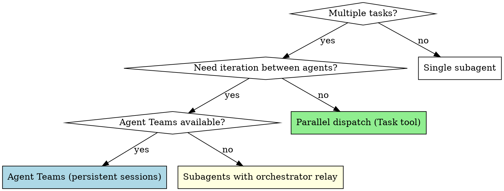

# Agent Orchestration

## Overview

You delegate tasks to specialized agents with isolated context. This skill covers two orchestration patterns and helps you choose between them.

**Core principle:** Use teams when agents need to iterate with each other. Use parallel subagents when you just need results back.

## Decision Framework



| Pattern | Use when | Mechanism |
|---------|----------|-----------|
| **Parallel dispatch** | Independent tasks, no shared state | Task tool, one-shot |
| **Agent Teams** | Creator↔reviewer iteration, feedback loops | Persistent sessions, peer messaging |
| **Orchestrator relay** | Need iteration but Teams unavailable | Subagents + orchestrator relays feedback |

**Rule of thumb:** If two agents will exchange feedback more than once, use a team (or orchestrator relay). If each agent does its work and returns a result, use parallel dispatch.

---

## Parallel Dispatch

For 2+ independent tasks that can be worked on without shared state or sequential dependencies.

### When to Use

- 3+ test files failing with different root causes
- Multiple subsystems broken independently
- Each problem can be understood without context from others
- No shared state between investigations

### When NOT to Use

- Failures are related (fixing one might fix others)
- Need to understand full system state
- Agents would interfere with each other (editing same files)

### The Pattern

#### 1. Identify Independent Domains

Group failures by what's broken:
- File A tests: Tool approval flow
- File B tests: Batch completion behavior
- File C tests: Abort functionality

Each domain is independent — fixing tool approval doesn't affect abort tests.

#### 2. Create Focused Agent Tasks

Each agent gets:
- **Specific scope:** One test file or subsystem
- **Clear goal:** Make these tests pass
- **Constraints:** Don't change other code
- **Expected output:** Summary of what you found and fixed

#### 3. Dispatch in Parallel

```typescript
// All three run concurrently
Task("Fix agent-tool-abort.test.ts failures")
Task("Fix batch-completion-behavior.test.ts failures")
Task("Fix tool-approval-race-conditions.test.ts failures")
```

#### 4. Review and Integrate

When agents return:
- Read each summary
- Verify fixes don't conflict
- Run full test suite
- Integrate all changes

### Agent Prompt Structure

Good agent prompts are:
1. **Focused** — One clear problem domain
2. **Self-contained** — All context needed to understand the problem
3. **Specific about output** — What should the agent return?

```markdown
Fix the 3 failing tests in src/agents/agent-tool-abort.test.ts:

1. "should abort tool with partial output capture" - expects 'interrupted at' in message
2. "should handle mixed completed and aborted tools" - fast tool aborted instead of completed
3. "should properly track pendingToolCount" - expects 3 results but gets 0

These are timing/race condition issues. Your task:

1. Read the test file and understand what each test verifies
2. Identify root cause - timing issues or actual bugs?
3. Fix by:
   - Replacing arbitrary timeouts with event-based waiting
   - Fixing bugs in abort implementation if found
   - Adjusting test expectations if testing changed behavior

Do NOT just increase timeouts - find the real issue.

Return: Summary of what you found and what you fixed.
```

### Common Mistakes

**Too broad:** "Fix all the tests" — agent gets lost
**No context:** "Fix the race condition" — agent doesn't know where
**No constraints:** Agent might refactor everything
**Vague output:** "Fix it" — you don't know what changed

### Verification

After agents return:
1. **Review each summary** — Understand what changed
2. **Check for conflicts** — Did agents edit same code?
3. **Run full suite** — Verify all fixes work together
4. **Spot check** — Agents can make systematic errors

---

## Agent Teams

Agent Teams let multiple Claude Code sessions work together with direct peer-to-peer communication and a shared task list. When available, prefer teams over orchestrator relay for workflows with iteration loops.

### Availability Check

Agent Teams require the experimental feature flag:
- Environment: `CLAUDE_CODE_EXPERIMENTAL_AGENT_TEAMS=1`
- Or settings.json: `{"env": {"CLAUDE_CODE_EXPERIMENTAL_AGENT_TEAMS": "1"}}`

If the session-start context includes "Agent Teams: available", use teams for appropriate workflows. Otherwise, fall back to subagent patterns (orchestrator relay).

### When to Use Teams vs Subagents

| Pattern | Use Teams | Use Subagents |
|---------|-----------|---------------|
| Creator ↔ reviewer iteration | Yes — direct feedback | No — orchestrator relays |
| Implementer ↔ reviewer iteration | Yes — direct feedback | No — orchestrator relays |
| Independent parallel tasks | No — overhead | Yes — Task tool |
| Single focused task | No — overhead | Yes — lighter weight |
| Sequential pipeline (no iteration) | No — no benefit | Yes — simpler |

### Critical Constraint: One Team Per Session

Only one team can exist per session. You must clean up the current team before starting a new one.

The full superRA workflow spans two team-worthy phases:

```
execution-workflow (Analysis Team)
  → cleanup
    → integration-workflow (Integration Team)
      → cleanup
        → merge-workflow (Merge Team)
          → cleanup
```

**Sequential teams with cleanup.** The lead cleans up each team before spawning the next:

1. All analysis tasks complete → shut down Analysis Team → clean up
2. If user chooses merge/PR (execution-workflow Step 4 Option 1 or 2) → spawn Integration Team → run drift test creation + refactor-review loop + report + dev doc handling → clean up
3. Spawn Merge Team → main update + post-merge verification + refactor-review loop + merge or PR + worktree cleanup → clean up

### Team Recipes

#### Analysis Task Team

**When:** `superRA:execution-workflow` in subagent mode with multiple tasks

**Teammates (3):**
- `implementer` — Executes analysis tasks (data-first discipline)
- `data-reviewer` — Reviews data integrity (must complete before implementation review)
- `implementation-reviewer` — Reviews implementation correctness

**Spawn:**
```
Create an agent team for analysis execution:
- implementer: [use `implementer` agent type; load superRA:econ-data-analysis; provide project context]
- data-reviewer: [use `reviewer` agent type; load superRA:econ-data-analysis; handoff: PLAN.md data integrity status]
- implementation-reviewer: [use `reviewer` agent type; load superRA:econ-data-analysis; handoff: PLAN.md APPROVED status]
```

**Task graph (per analysis task N):**
1. `implement-task-N` → assigned: implementer
2. `data-review-task-N` → depends: implement-task-N, assigned: data-reviewer
3. `impl-review-task-N` → depends: data-review-task-N, assigned: implementation-reviewer

**Cross-task dependency:** `implement-task-N+1` depends on `impl-review-task-N`. This prevents the implementer from starting the next task before the current one is fully approved.

Create all tasks upfront from PLAN.md so teammates can see the full scope.

**Iteration:** When data-reviewer finds issues, they message implementer directly with specific feedback. Implementer fixes the code, then messages data-reviewer to re-review. Same pattern for implementation-reviewer ↔ implementer.

**Lead responsibilities:**
- Read PLAN.md, create full task graph with all dependencies
- Provide each teammate with their agent type, skill to load, and project context
- Verify that teammates commit their own PLAN.md and RESULTS_UPDATE.md updates atomically with their work (per execution-workflow responsibility matrix)
- Monitor for BLOCKED or data quality escalations (teammates message lead)
- Handle sensitivity analysis assessment
- Note team phase in PLAN.md (e.g., "Analysis Team active, tasks 1-3 of 5 complete")
- Clean up team before proceeding to integration-workflow

#### Integration Team

**When:** `superRA:integration-workflow` is invoked (from execution-workflow Step 4 Option 1 or 2). Spawned by the lead after the Analysis Team has been cleaned up.

**Teammates (4):**
- `test-creator` — Creates drift tests for key results
- `test-reviewer` — Reviews tests for coverage, tolerances, independence
- `refactorer` — Refactors code for codebase integration
- `integration-reviewer` — Reviews integration quality

**Spawn:**
```
Create an agent team for the integration workflow:
- test-creator: [use `implementer` agent type; load superRA:refactor-and-integrate; domain ref basename: drift-test-quality.md]
- test-reviewer: [use `reviewer` agent type; load superRA:refactor-and-integrate; domain ref basename: drift-test-quality.md]
- refactorer: [use `implementer` agent type; load superRA:refactor-and-integrate; domain ref basename: codebase-integration.md]
- integration-reviewer: [use `reviewer` agent type; load superRA:refactor-and-integrate; domain ref basename: codebase-integration.md]

All teammates auto-load superRA:econ-data-analysis and superRA:script-to-notebook via the agent definition since the stage touches analysis code. Require plan approval before they make changes.
```

**Task graph:**
1. `create-drift-tests` → assigned: test-creator
2. `review-drift-tests` → depends: 1, assigned: test-reviewer
3. `establish-green-baseline` → depends: 2, assigned: test-creator (run tests)
4. `review-integration` → depends: 3, assigned: integration-reviewer
5. `refactor-code` → depends: 4 (only if REVISE), assigned: refactorer
6. `run-drift-tests-post-refactor` → depends: 5, assigned: refactorer
7. `re-review-integration` → depends: 6, assigned: integration-reviewer

**Flow:** Integration reviewer runs first (task 4). If APPROVE, no refactoring needed — skip tasks 5-7. If REVISE, refactorer addresses specific feedback (task 5), drift tests verify (task 6), integration reviewer re-reviews (task 7). Loop until APPROVE.

**Iteration:** When test-reviewer sends REVISE, they message test-creator directly with specific feedback. Test-creator fixes and marks task updated. Test-reviewer re-reviews. For the integration loop: integration-reviewer messages refactorer with specific issues, refactorer fixes and runs drift tests, then messages integration-reviewer to re-review.

**Orchestrator discipline for reviewer feedback:** The lead adjudicates REVISE feedback from both test-reviewer and integration-reviewer per `superRA:execution-workflow` Handling Reviewer Feedback — read the cited code, classify each issue, override with documented reasoning where the reviewer is wrong, never silently dismiss CRITICAL. This applies whether or not you are using Agent Teams mode.

**Lead responsibilities:**
- Present drift test candidates to user BEFORE creating team (Stage 1 user confirmation)
- Create team and task graph with dependencies
- Adjudicate every REVISE round per orchestrator discipline; forward only accepted issues to the refactorer or test-creator
- Monitor for meaningful drift escalations from refactorer
- Generate the work-journal report (integration-workflow Step 3 — no team work, lead does this)
- Handle PLAN.md / RESULTS_UPDATE.md disposition (integration-workflow Step 4 — lead asks user and executes git mv/rm)
- Handle user communication for all escalation decisions
- Commit at stage boundaries
- **Clean up team before proceeding to merge-workflow** (the Merge Team needs the session slot)

#### Merge Team

**When:** `superRA:merge-workflow` is invoked (from execution-workflow Step 4 Option 1 or 2 after integration-workflow has returned). Spawned by the lead after the Integration Team has been cleaned up.

**Teammates (4):**
- `merge-proposer` — Invokes semantic-merge internally for tier classification; executes the two-commit main-update merge
- `merge-reviewer` — Reviews the main update for intent preservation, research integrity, data discipline
- `post-merge-refactorer` — Re-refactors analysis code if the main update introduced convention drift (same role as the Integration Team's refactorer but against the merged state)
- `post-merge-integration-reviewer` — Runs drift tests AND reviews codebase integration on the merged state; approves only when both pass

**Spawn:**
```
Create an agent team for the merge workflow:
- merge-proposer: [use `implementer` agent type; load superRA:refactor-and-integrate; domain ref basename: merge-quality.md; note: invokes semantic-merge internally for Tier classification]
- merge-reviewer: [use `reviewer` agent type; load superRA:refactor-and-integrate; domain ref basename: merge-quality.md]
- post-merge-refactorer: [use `implementer` agent type; load superRA:refactor-and-integrate; domain ref basename: codebase-integration.md]
- post-merge-integration-reviewer: [use `reviewer` agent type; load superRA:refactor-and-integrate; domain ref basename: codebase-integration.md; note: must run BOTH drift tests AND codebase integration review on the merged state]

All teammates auto-load superRA:econ-data-analysis and superRA:script-to-notebook via the agent definition since the stage touches analysis code.
```

**Task graph:**
1. `propose-main-update-merge` → assigned: merge-proposer (Step 1 of merge-workflow)
2. `review-main-update-merge` → depends: 1, assigned: merge-reviewer
3. `run-post-merge-drift-tests` → depends: 2, assigned: post-merge-integration-reviewer (Step 2a — drift tests)
4. `post-merge-integration-review` → depends: 3, assigned: post-merge-integration-reviewer (Step 2b — codebase integration on merged state)
5. `post-merge-refactor` → depends: 4 (only if REVISE OR drift tests failed), assigned: post-merge-refactorer (Step 3)
6. `re-run-drift-tests` → depends: 5, assigned: post-merge-refactorer
7. `re-review-post-merge-integration` → depends: 6, assigned: post-merge-integration-reviewer

**Flow:** Main update → review → drift tests + integration review on merged state → if either fails, refactor-review loop (tasks 5-7) → iterate until drift tests pass AND integration reviewer APPROVES → lead executes Step 4 (local merge or PR push) outside the team → lead cleans up team and worktree.

**Iteration:** Same direct-message pattern as the Integration Team. post-merge-integration-reviewer messages post-merge-refactorer with specific issues, refactorer addresses them and re-runs drift tests, then messages the reviewer back.

**Orchestrator discipline for reviewer feedback:** Same as Integration Team. This is especially important post-merge because main may have moved in ways that introduce false-positive integration issues — the lead must distinguish real drift from cosmetic convention drift and adjudicate accordingly. See `superRA:execution-workflow` Handling Reviewer Feedback.

**Meaningful drift escalation:** When post-merge drift tests show meaningful result changes (not rounding), STOP. This is a research conversation, not a refactor. Show the user before/after values from the merge and wait for instructions. Do not update test expectations to "make it green."

**Lead responsibilities:**
- Spawn team only after Integration Team cleanup
- Adjudicate every REVISE round per orchestrator discipline
- Escalate meaningful drift to the user
- Execute Step 4 (local merge `git checkout && git merge` OR `git push && gh pr create`) outside the team after reviewer APPROVE — lead does this, not a teammate
- Execute Step 5 (worktree cleanup) outside the team
- Clean up team after final APPROVE and merge/PR is complete

#### Semantic Merge Team

**When:** `superRA:semantic-merge` at Tier 2 or Tier 3

**Teammates (2):**
- `merge-proposer` — Analyzes incoming intent, proposes integration, executes two-commit merge
- `merge-reviewer` — Reviews integration for intent preservation, research integrity, data discipline

**Spawn:**
```
Create an agent team for semantic merge integration:
- merge-proposer: [use `implementer` agent type; load superRA:refactor-and-integrate; domain ref basename: merge-quality.md]
- merge-reviewer: [use `reviewer` agent type; load superRA:refactor-and-integrate; domain ref basename: merge-quality.md]

All teammates auto-load superRA:econ-data-analysis via the agent definition.
```

**Task graph:**
1. `propose-integration` → assigned: merge-proposer
2. `review-integration` → depends: 1, assigned: merge-reviewer

**Iteration:** When merge-reviewer sends REVISE, they message merge-proposer directly with specific feedback (what conflict resolution is wrong, what reference is stale). Merge-proposer fixes and messages back. Merge-reviewer re-reviews.

**Lead responsibilities:**
- Perform tier classification before deciding whether to spawn team (Tier 1 = no team)
- For Tier 3: present integration map to user, relay user decisions to proposer
- Commit at each stage (mechanical commit, integration commit)
- Run drift tests and pipeline verification after integration
- Handle drift test failure escalation to user
- Clean up team after final APPROVE

**Team slot and scope:** This team is for **ad-hoc semantic-merge invocations** — when the merge-guard hook fires on a bare `git merge` / `git rebase` / `git cherry-pick` and the user loads `superRA:semantic-merge` directly (outside the analysis-finishing flow). Inside the analysis-finishing flow, merge-workflow spawns its own Merge Team (above) which includes merge-proposer + merge-reviewer plus the post-merge refactor-review teammates. Do not spawn both teams at once — they share the same session slot.

### Team Lifecycle & Session Handoff

#### Cleanup Protocol

When a team's work is complete:

1. Shut down each teammate: "Ask [teammate-name] to shut down"
2. Wait for all teammates to confirm shutdown
3. Clean up team resources: "Clean up the team"
4. Verify cleanup: team config and task list removed

**Always use the lead to clean up.** Teammates should not run cleanup.

#### Session Interruption

If context runs out or the session ends mid-team:
- **Teammates are lost.** `/resume` and `/rewind` do not restore teammates.
- **Completed work is safe.** All completed tasks are committed to git and recorded in PLAN.md/RESULTS_UPDATE.md.
- **New session detects in-progress work.** SuperRA's cross-session detection (in `using-superRA`) checks for incomplete PLAN.md.
- **Resume with new team.** New session reads PLAN.md to find last completed task, spawns a fresh team for remaining work.

#### Checkpointing for Team Safety

Because teammates can be lost at any time, checkpointing discipline is critical:
- Commit after each completed task (already required by superRA)
- Update PLAN.md and mark tasks `- [x]` with result notes (already required)
- Update RESULTS_UPDATE.md with findings (already required)
- **Additionally:** Lead records active team phase in PLAN.md when spawning a team

Example PLAN.md team status note:
```markdown
## Team Status
Analysis Team active. Tasks 1-3 of 5 complete. Data-reviewer reviewing task 4.
```

On session resume, this tells the new lead exactly where to pick up.

### Constraints

**File conflicts:** Never assign two teammates to edit the same file simultaneously. Task dependencies prevent this for sequential work. For parallel tasks, ensure each teammate owns different files.

**Ordering guarantees:** Data integrity review MUST complete before implementation review. Enforce via task dependencies, never via convention.

**Escalation to user:** Teammates must message the lead (not the user directly) for escalation decisions. The lead handles all user communication.

**Team size:** Keep teams small (3-5 teammates). Larger teams increase coordination overhead and token cost without proportional benefit.

**Cleanup:** Lead must shut down all teammates and clean up team resources when done. Never leave zombie teammates running.

### Known Limitations

- **No session resumption** — `/resume` and `/rewind` do not restore teammates
- **Task status can lag** — teammates sometimes fail to mark tasks as completed; check if work is actually done
- **One team per session** — must clean up before starting a new team
- **No nested teams** — teammates cannot spawn their own teams (they can use subagents via Task tool)
- **Skills/mcpServers frontmatter** — not applied to team teammates; they load from project and user settings like regular sessions
- **Shutdown can be slow** — teammates finish current request/tool call before shutting down

---

## Integration

**Skills that use Agent Teams mode:**
- **superRA:execution-workflow** — 3-teammate analysis team (implementer + data-reviewer + implementation-reviewer)
- **superRA:integration-workflow** — 4-teammate integration team (test-creator + test-reviewer + refactorer + integration-reviewer)
- **superRA:merge-workflow** — 4-teammate merge team (merge-proposer + merge-reviewer + post-merge refactorer + post-merge integration-reviewer)
- **superRA:semantic-merge** — 2-teammate merge team (merge-proposer + merge-reviewer)

**When Agent Teams are unavailable:** All skills fall back to standard subagent patterns (Task tool dispatch with orchestrator-as-hub). No functionality is lost — teams are an enhancement, not a requirement.
