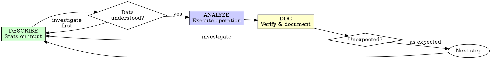

# Economic Data Analysis

## The Iron Law

```
NO TRANSFORMATION WITHOUT PRIOR DESCRIPTION
```

Transformed data without describing it first? Undo the transformation. Start over.

**No exceptions:**
- Don't keep the merged result as "it looks fine"
- Don't "check it later at the end"
- Don't rely on a description from a previous session
- Undo means undo

Describe fresh from the current data state. Period.

**Violating the letter of the rules is violating the spirit of the rules.**

---

Three concurrent principles for rigorous data work. These are not sequential
stages — apply all three at every point in the analysis.

## Principle 1: Description Before Analysis

The most common analytical error is transforming data you do not understand.
**Describe thoroughly and often.**

### After loading any dataset

**Panel structure** (first priority for panel/longitudinal data — the common case):
- Identify the **panel ID** (firm, fund, country, individual) and **time ID**
  (year, quarter, month, day)
- Count unique IDs and unique time periods; verify against expectations
- Date range: min and max; any expected periods absent?
- **Balancedness**: compute periods-per-unit distribution (mean, median, min, max).
  Balanced ratio = actual rows / (N_ids × T_periods). If unbalanced, characterize
  the pattern — entry/exit, mid-panel gaps, or expanding coverage?
- For pure cross-sections, note it and skip panel diagnostics

**Variable diagnostics** — tailor to type, focus on key variables:
- **Continuous** (returns, prices, GDP, weights): mean, median, std, min, max,
  and tail percentiles (p1, p5, p95, p99) — tails detect outliers
- **Categorical/binary** (sector codes, indicators, country): value counts and
  shares; check for unexpected categories or near-zero frequencies
- **Identifiers**: does panel ID × time uniquely identify rows? Check for duplicates
- Do NOT run blanket `describe()` on all columns — select key variables explicitly

**Data types and missing values**:
- Column types: dates as dates, numerics as numerics (not object/string)
- Missing values: count and share per variable; is missingness random or
  systematic (concentrated in certain periods, countries, or correlated with
  other variables)?
- Compare to source documentation if expected sample size is stated

When data was already imported and validated upstream, read existing diagnostics
rather than re-running full validation.

### After every major transformation

Re-run descriptive statistics on affected variables. Compare before/after.
Major transformations include: merges, filters, variable construction,
aggregations, reshaping, deduplication.

**Rule: if something looks unexpected, investigate before proceeding.**
Do not use a variable downstream until its distribution is understood.

### Outlier decisions

- Flag observations beyond p1/p99 — are they data errors or genuine extremes?
- For naturally skewed variables (firm size, wealth, trade volumes), extreme
  values may be real — document the decision to keep, winsorize, or trim
- If winsorizing, document cutoff and consider robustness with alternatives
  (see `references/data-robustness-checklist.md`)

## Principle 2: Logs and Documentation

Analysis scripts should be human-readable documents that interleave code,
narrative, and outputs.

### Script categories

- **Analysis scripts** (data loading, cleaning, merging, variable construction,
  diagnostics): format for notebook rendering — see `superRA:script-to-notebook`
  for cell organization and rendering details.
- **Runner/utility/pipeline scripts**: standard script format, no notebook
  formatting needed.

### Row count tracking

Log before/after row counts for **every** sample-changing operation:
merges, filters, drops, deduplication, sample restrictions. Major operations
(merges, large filters) typically warrant their own cell; minor operations can
share a cell as long as the count is printed.

### Decision documentation

- **Minor** decisions (winsorization percentile, filter threshold): inline comment
- **Major** decisions (excluding countries, choosing sample period, variable
  definition): markdown cell with reasoning

### Visualization for key variables

Supplement summary statistics with diagnostic plots. These are part of
describing data — create them alongside the statistics they complement.

- **Distributions**: histograms for continuous variables — reveals skew, modes,
  and outliers that summary stats miss. Use for any variable you're about to
  transform, winsorize, or filter on.
- **Relationships**: scatter plots for variable pairs — shows nonlinearity,
  clusters, and influential observations that correlations hide.
- **Temporal patterns**: line plots of variable vs time — detects structural
  breaks, trends, and seasonality. Essential for any time-series variable.

Not publication quality. Clear axis labels, informative titles, readable scales.
Save to the output directory alongside notebook renders.

### Output rendering

For rendering scripts as notebooks, see `superRA:script-to-notebook`.

## Principle 3: Multi-Source Validation

Numbers must make economic sense. Validate against intuition, literature, and
cross-variable relationships.

### Scale check

Does the magnitude match economic intuition? GDP growth of 300% is wrong;
stock returns of -99% need investigation. Compare summary statistics to
published benchmarks (IMF WEO, World Bank, central bank data, prior literature).

### Property check

Is the variable's behavior consistent with priors or what the literature has
found? For constructed variables, spot-check a few observations by hand.
For growth rates, verify against published figures for well-known cases.

### Relationship check

- Compute correlations between new variables and known related measures
- Signs and magnitudes consistent with published stylized facts?
  (e.g., GDP growth positively correlated with employment growth)
- Conditional means across subgroups behave as expected?
  (e.g., developed vs. emerging, pre/post crisis)

### Reference verification

For key variables, find at least one external reference to verify alignment.
If a relationship looks surprising, investigate before proceeding — it may
indicate a data or construction error.

### Missing data as validation signal

- Systematic missingness (concentrated in time/geography) is informative —
  investigate whether it reflects true data absence or a construction error
- Ask: what does "missing" mean here? No position (→ zero) vs didn't report
  (→ truly missing) — the correct treatment depends on the data source and
  research question
- Missing returns treated as zero is almost always wrong

## Describe-Analyze-Doc

The operational cycle that implements the three principles at every step.



### DESCRIBE — Understand the Input

Run descriptive statistics on the data you are about to work with.
Follow the Principle 1 protocol above for panel structure, variable diagnostics,
and data types/missing values. Key points:

**Panel structure** (if applicable):
- Panel ID and time ID, unique counts of each
- Date range, balancedness (periods per unit)
- Does panel ID × time uniquely identify rows?

**Variable diagnostics** (key variables only, not blanket `describe()`):
- Continuous: mean, median, std, p1, p5, p95, p99
- Categorical: value counts and shares
- Missing: count, share, systematic patterns

**Before a merge:** also describe the join keys in both tables — unique values, overlap.

### ANALYZE — Execute the Operation

Apply the data operation: merge, filter, construct variable, aggregate.

**One logical operation per step.** Don't chain merge + filter + construct in a single step.

Row count printed before and after (for sample-changing operations).

### DOC — Verify and Document

Verify the result, then document everything. You can't document properly without checking — the evidence IS the documentation.

**Row counts:**
- Left join: row count should match left table (if right side is m:1)
- Inner join: expect fewer rows — how many dropped?
- Filter: how many rows removed? Is the drop rate reasonable?

**Distribution checks:**
- Re-run descriptive stats on affected variables
- Compare to pre-transformation values
- Flag anything unexpected

**Economic sense:**
- Magnitudes plausible? GDP growth of 300% is wrong.
- Signs correct? Correlations match known stylized facts?
- Spot-check a few observations by hand
- When expected results or hypotheses are provided in PLAN.md, compare findings to them — flag and investigate divergences

**Log in markdown cells:**
- What you did and why
- Row count changes
- Any surprising findings
- Decision justifications (why this filter threshold, why this join type)

**If something looks unexpected:** STOP. Investigate before proceeding.

**Row count tracking is mandatory** for every sample-changing operation.

## Common Rationalizations

| Excuse | Reality |
|--------|---------|
| "Data looks fine" | You haven't described it. You don't know. |
| "Just a simple merge" | Simple merges create the worst silent bugs. |
| "I'll validate at the end" | Can't isolate which step caused the problem. |
| "Already know this data" | Your memory ≠ current state. Describe it. |
| "It's the same as last session" | Files change. Upstream code changes. Describe fresh. |
| "Only filtering, not transforming" | Filters change your sample. Describe what you're losing. |
| "Quick exploration, not formal analysis" | If results inform decisions, they must be validated. |
| "Row counts match, so the merge is fine" | Row counts don't catch value corruption or key mismatches. |
| "I'll add descriptions when I write it up" | After-the-fact descriptions are biased by what you built. |
| "Describing is busywork" | 30 seconds of describing vs hours of debugging wrong results. |

## Red Flags - STOP and Start Over

- Transform before describe
- Merge without checking join keys in both tables
- No row count printed after sample-changing operation
- "Looks fine" without running diagnostics
- Descriptions added after the fact
- Skipping validation because "the numbers look right"
- Multiple transformations without intermediate validation
- Rationalizing "just this once"
- "I already checked this data in a previous session"
- "This is exploratory so it doesn't matter"

**All of these mean: Undo the transformation. Describe first. Start over from that step.**

## Verification Checklist

Before marking a step complete:

**DESCRIBE:**
- [ ] Described input data before the operation
- [ ] Key variables examined with appropriate diagnostics
- [ ] Panel structure documented (if applicable)

**ANALYZE:**
- [ ] Operation matches plan specification
- [ ] Row counts logged before and after (if sample-changing)

**DOC:**
- [ ] Output validated against expectations
- [ ] Economic sense checked (magnitudes, signs, relationships)
- [ ] Decisions documented in markdown cells
- [ ] Unexpected findings investigated before proceeding

Can't check all boxes? You skipped data-first discipline. Start over from the describe step.

## Pitfalls

Concise checklists for common data manipulation errors. Consult when performing
the relevant operation.

### Merges and joins

- **Before**: check row counts and unique join-key values in both tables
- **Join type**: 1:1, m:1, or 1:m. Many-to-many is almost always a bug —
  it creates a Cartesian product that silently inflates row counts
- **After**: row count should match left table for left join (unless right
  has dupes on the join key — the many-to-many trap)
- **Unmatched**: log how many rows from each side did not match; assess whether
  non-matching is random or systematic

### Time-series operations (lag, lead, diff, cumsum, fill)

- **Sort first**: sort by panel ID + time before any time-series operation.
  Joins destroy sort order — always re-sort after any merge
- **Check for gaps** before applying lags/leads/diffs. If unit `i` is missing
  period `t`, a naive `shift(1)` treats period `t+1`'s lag as `t-1`'s value —
  silently wrong. Diagnose gaps per unit before proceeding
- **Use time-aware operators** when available: in Julia, `PanelShift.jl`
  handles gaps correctly; in Python, merge on lagged time index or `reindex`
  to a full time grid before shifting. If the framework only supports positional
  shift, verify there are no gaps first, or fill gaps explicitly (with NaN,
  not interpolation) so shifts are correct
- **After**: spot-check a few units to confirm the lag/lead aligns with the
  correct time period, especially near panel entry/exit

### Reshaping

- After pivot: unique IDs × unique time periods should match original shape
- Check for unintended NAs from unbalanced panels going wide

### Aggregations

- **Function**: sum dollar amounts, average rates — never the reverse.
  Averaging dollars or summing rates are common silent errors
- **Group-by keys**: verify they match intended level (country-year, not
  country-month)
- **Weights**: if weighted average, verify weights sum to expected values
- **Duplicates**: handle before aggregating — dupes cause double-counting

### Deduplication

- Check uniqueness before operations that assume it (merges, index-setting)
- Document which duplicate kept and why (first, last, highest value, etc.)

### Filtering

- Log rows dropped: count, reason, before/after
- Check non-randomness: are drops concentrated in certain countries, periods,
  or variable ranges? This may introduce sample selection bias
- Verify boolean logic: `&` vs `|` errors are a common silent bug
- Watch chained filters for unintended cumulative effects

### Variable construction

- **Transformation order**: log → winsorize → standardize
  (log after standardize fails because standardized values can be negative)
- **Ratio denominators**: check for zero/near-zero; extreme ratios often come
  from small denominators
- **Growth rates**: compare to published benchmarks for spot checks; first
  differences amplify measurement error — inspect for implausible spikes
- **Standardization**: verify mean ≈ 0, std ≈ 1 within the relevant sample;
  be clear about cross-sectional vs time-series vs pooled

### Missing data handling

- **Explicit** handling (`.fillna(0)`, `.dropna()`, filters) is visible and auditable
- **Implicit** handling (package defaults silently ignoring NaN in aggregations)
  is easy to miss — check alignment with analytical objective
- Ask: what does "missing" mean in this specific context?
- Prefer passing missing through the pipeline over filling silently;
  use fill/coalesce only with explicit justification

## Key References

- `superRA:script-to-notebook` — cell organization, rendering (Python jupytext, Julia QuartoNotebookRunner)
- `references/data-robustness-checklist.md` — sensitivity analysis: outlier
  alternatives, alternative definitions, sample restrictions, leave-one-out
- Gentzkow & Shapiro (2014), "Code and Data for the Social Sciences"
- AEA Data Editor, "Guidance for Replication Packages"
