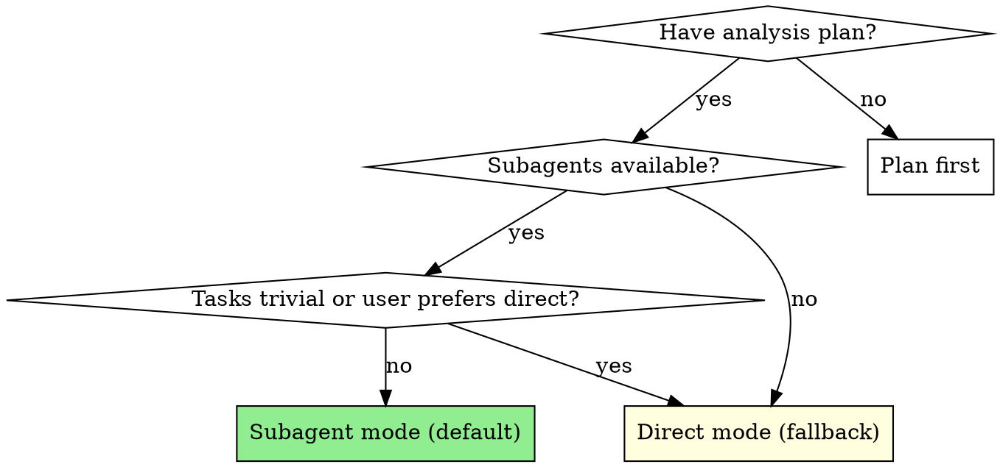
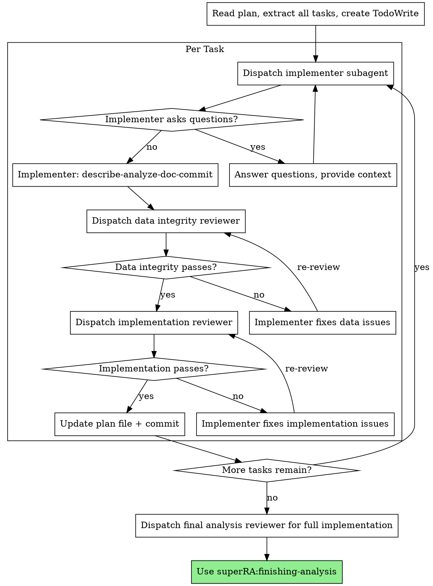

# Executing Analysis

Execute an analysis plan with data-first discipline. This skill covers the **IMPLEMENT** and **VALIDATE** phases of the macro workflow: dispatching implementers (IMPLEMENT) and running two-stage review (VALIDATE).

Default mode dispatches a fresh subagent per task with two-stage review (data integrity then implementation correctness). Falls back to direct execution when the user requests it or tasks are trivial.

**Core principle:** Fresh subagent per task + two-stage review = high quality, reproducible analysis. Review always happens regardless of execution mode.

**Announce at start:** "I'm using the executing-analysis skill to implement this analysis plan."

## Execution Modes



**Subagent mode (default):**
- Dispatch implementer subagent per task
- Two-stage review after each: data integrity → implementation correctness
- Fresh context per task (no pollution)
- Orchestrator preserves context for coordination

**Direct mode (fallback):**
- Main agent implements tasks directly
- Still dispatches reviewer subagents after each task (review is never skipped)
- Use when: user explicitly requests it, single trivial task, or platform lacks subagents

## The Process



### Step 0: Branch Check

Before starting execution, check if on a default branch:

```bash
git branch --show-current
```

If on `main` or `master`:
```
You're on main. I recommend creating a feature branch for this analysis:
  git checkout -b analysis/<topic>
Want me to create one?
```

If the user declines, proceed — they've given explicit consent to work on the default branch.

### Step 1: Load and Review Plan

1. Read `PLAN.md` and `RESULTS_UPDATE.md`
2. Review PLAN.md critically — identify any questions or concerns:
   - Are data sources available and accessible?
   - Are the steps in the right order?
   - Is the pipeline file included (for multi-script analyses)?
3. Review RESULTS_UPDATE.md for context on any completed steps (if resuming)
4. If concerns: Raise them with your human partner before starting
5. If no concerns: Create TodoWrite with all steps and proceed

### Step 2: Execute Tasks

#### Per-Task Execution Steps

1. **Dispatch implementer:**
   - Subagent mode: `Agent(subagent_type: "implementer")` — see dispatch example below
   - Direct mode: invoke `superRA:implementer-protocol`, then implement yourself
2. **If NEEDS_CONTEXT or BLOCKED:** provide context and re-dispatch (see Handling Implementer Status below)
3. **Once DONE or DONE_WITH_CONCERNS:**
   - The implementer has already committed: code + PLAN.md (steps `[x]`, status `IMPLEMENTED`) + RESULTS_UPDATE.md (findings)
   a. Dispatch data integrity reviewer: `Agent(subagent_type: "reviewer")` — see dispatch example below
   b. **If REVISE:** The reviewer has committed review notes to PLAN.md. Clear the review notes, then re-dispatch the implementer with the reviewer's specific feedback items. Then re-dispatch the data integrity reviewer. Iterate until APPROVE. Do NOT proceed to implementation review until data integrity is approved.
4. **Once data integrity APPROVE:**
   a. Dispatch implementation reviewer: `Agent(subagent_type: "reviewer")` — same agent type, different handoff rules
   b. **If REVISE:** Same pattern — reviewer commits notes, you clear them, re-dispatch implementer, re-dispatch reviewer. Iterate until APPROVE.
5. **Once implementation reviewer APPROVE:**
   - The impl reviewer has committed `**Review status:** APPROVED` to PLAN.md
   - If findings change upcoming tasks: update future task descriptions in PLAN.md and commit
   - Proceed to next task

**In direct mode:** Steps 1-2 are done by the main agent directly (invoke `superRA:implementer-protocol` for the execution protocol, invoke `superRA:econ-data-analysis` for discipline, invoke `superRA:script-to-notebook` for script formatting). Steps 3-5 are unchanged — still dispatch reviewer subagents.

#### Dispatch Examples

**Implementer:**
```
Agent(subagent_type: "implementer"):
  Load skills: superRA:econ-data-analysis, superRA:script-to-notebook
  Task: Implement Task N: [task name]
  Task description: [FULL TEXT from PLAN.md — paste it, don't make subagent read file]
  Context: [what analysis this is, what prior steps produced, what data is available]
  Expected results: [hypotheses from PLAN.md, if any]
  Prior results: [key findings from RESULTS_UPDATE.md]
  Work from: [directory]
  Handoff: Mark steps [x] in PLAN.md, set IMPLEMENTED, write findings to RESULTS_UPDATE.md.
    Commit together: code + PLAN.md + RESULTS_UPDATE.md
  Counterpart: reviewer (for Agent Teams)
```

**Data integrity reviewer:**
```
Agent(subagent_type: "reviewer"):
  Load skill: superRA:econ-data-analysis
  Review scope: data integrity for Task N
  What was requested: [task requirements from PLAN.md]
  What implementer claims: [from implementer's report — key findings, row counts, concerns]
  Handoff: If REVISE — set PLAN.md status to "REVISE (data integrity)" with issues blockquote, commit.
    If APPROVE with concerns — add caveat to RESULTS_UPDATE.md, commit.
    If APPROVE clean — no commits needed.
  Counterpart: implementer (for Agent Teams)
```

**Implementation reviewer:**
```
Agent(subagent_type: "reviewer"):
  Load skills: superRA:econ-data-analysis, superRA:script-to-notebook
  Review scope: implementation correctness for Task N
  What was requested: [task requirements]
  What implementer built: [from implementer's report]
  Expected results: [from PLAN.md, if provided]
  Handoff: If REVISE — set PLAN.md status to "REVISE (implementation)" with issues, commit.
    If APPROVE — set PLAN.md status to "APPROVED", commit.
    Add reliability caveats to RESULTS_UPDATE.md if needed.
  Counterpart: implementer (for Agent Teams)
```

### Step 3: Verify Pipeline

After all tasks complete:

1. If the analysis has multiple scripts, verify the pipeline file runs end-to-end:
   ```bash
   bash run_all.sh  # or: julia pipeline.jl
   ```
2. Check that all expected outputs exist (tables, figures, logs)
3. Verify outputs are generated from committed code (reproducibility gate)

### Step 4: Complete Analysis

After all tasks complete and pipeline verified:
- Dispatch a final analysis reviewer for the full implementation
- **REQUIRED SKILL:** Use superRA:finishing-analysis
- Follow that skill to generate report, present merge/PR options

## Responsibility Matrix

Who owns what — each agent commits its own doc updates atomically with its work:

| Responsibility | Owner | Committed with |
|---|---|---|
| Code implementation | Implementer | code commit |
| Mark own task's steps `- [x]` in PLAN.md | Implementer | code commit |
| Set own task's status to `IMPLEMENTED` in PLAN.md | Implementer | code commit |
| Write own task's findings to RESULTS_UPDATE.md | Implementer | code commit |
| Self-review before reporting | Implementer | — |
| Set own task's status to `REVISE` + write review issues in PLAN.md | Reviewer | review commit |
| Write reliability caveats for own task in RESULTS_UPDATE.md | Reviewer | review commit |
| Set own task's status to `APPROVED` in PLAN.md | Impl reviewer (final reviewer) | review commit |
| Clear review notes before re-dispatch | Orchestrator | — |
| Modify future tasks when findings change the plan | Orchestrator | plan update commit |
| Task sequencing, dispatch, REVISE loop management | Orchestrator | — |
| User communication and escalation | Orchestrator | — |

**Scope rule:** Agents only edit the PLAN.md and RESULTS_UPDATE.md sections for their own assigned task. Never modify other tasks' status, steps, findings, or review notes.

## Review Status Protocol

Each task in PLAN.md carries a `**Review status:**` line that tracks where it stands in the execution-review cycle:

| Status | Meaning | Set by |
|--------|---------|--------|
| *(no line)* | Not started | — |
| `IMPLEMENTED` | Code committed, awaiting review | Implementer |
| `REVISE (data integrity)` | Data reviewer found issues | Data reviewer |
| `REVISE (implementation)` | Impl reviewer found issues | Impl reviewer |
| `APPROVED` | Both reviews passed, task complete | Impl reviewer (final reviewer) |

**Review notes format** — when a reviewer returns REVISE, they add issues as a blockquote under the task heading:

```markdown
### Task 3: Merge holdings with characteristics
**Review status:** REVISE (data integrity)

> **Review issues (data integrity):**
> - Row count not logged after left join (03_merge.py:45) — MAJOR
> - Unmatched rate (2.1%) not investigated — MAJOR
```

**Lifecycle:**
1. Reviewer adds notes when returning REVISE
2. Orchestrator clears the review notes blockquote before re-dispatching the implementer (feedback is given in the dispatch prompt)
3. Implementer fixes code, re-sets `IMPLEMENTED` → commits
4. Reviewer re-reviews — either adds new notes (REVISE) or sets APPROVED

**Reliability caveats** — persistent notes in RESULTS_UPDATE.md for analytical concerns:

```markdown
> **⚠️ Reviewer note (data integrity):** Unmatched rate concentrated in small-cap funds. May bias downstream regressions.
```

These persist — only the user should remove them.

**A task is complete only when its status is APPROVED.** Do not proceed to the next task while either review has open issues.

## Plan File Updates

Each agent updates docs at its own stage — no orchestrator transcription step:

**Implementer** (after completing task code):
1. Mark own task's steps `- [x]` in PLAN.md with brief result notes
2. Set `**Review status:** IMPLEMENTED` under own task heading
3. Add own task's findings to RESULTS_UPDATE.md (row counts, key results, figures)
4. Save any figure attachments to `results_attachments/`
5. Commit everything together: code + PLAN.md + RESULTS_UPDATE.md + attachments

**Reviewer** (after reviewing):
- If REVISE: set status + write review issues under own task in PLAN.md, commit
- If APPROVE with caveats: write reliability note under own task in RESULTS_UPDATE.md, commit
- If APPROVE (final reviewer): set `**Review status:** APPROVED`, commit

**Orchestrator** (after task fully approved):
- If findings change upcoming tasks: update future task descriptions in PLAN.md, commit
- Add discovery notes affecting the plan (e.g., "high unmatched rate — investigate before regression")

PLAN.md and RESULTS_UPDATE.md are living documents. Together they form the handoff: PLAN.md = what to do + review state, RESULTS_UPDATE.md = what was found + reviewer caveats. They must always reflect current understanding so the next agent (or session) can pick up where this one left off.

**Review scope at interim checkpoints:** Data integrity and implementation correctness only. Codebase integration review is deferred to the pre-merge gate (invoked during finishing-analysis when merging/PRing).

## Sensitivity Analysis Tasks

When executing sensitivity analysis tasks:

- Provide implementer with baseline results from RESULTS_UPDATE.md
- If sensitivity check shows divergence from baseline: assess **economic significance**, not just statistical
- If unsure whether a sensitivity failure is meaningful: **escalate to human partner** before proceeding
- Document the assessment in RESULTS_UPDATE.md
- Not all sensitivity failures are problems — use economic reasoning

## Model Selection

Use the least powerful model that can handle each role:

**Mechanical analysis tasks** (load data, run diagnostics, simple merges): fast, cheap model.

**Complex analysis tasks** (multi-source merges, variable construction with judgment): standard model.

**Review tasks**: most capable available model.

## Handling Implementer Status

**DONE:** Proceed to data integrity review.

**DONE_WITH_CONCERNS:** Read the concerns. If about data quality or unexpected findings, investigate before review. If about methodology choices, note and proceed to review.

**NEEDS_CONTEXT:** Provide missing data documentation, upstream results, or methodology details and re-dispatch.

**BLOCKED:** Assess the blocker:
1. Data not available → help locate or download
2. Data quality too poor → escalate to human partner
3. Task requires methodology decisions → escalate to human partner
4. Task too complex → break into smaller pieces or use more capable model

## When to Stop and Ask for Help

**STOP executing immediately when:**
- Data description reveals unexpected issues (wrong magnitudes, high missingness)
- Merge produces unexpected row count change
- Validation fails (results don't match economic intuition)
- Plan has critical gaps preventing next step
- Pipeline file is missing and analysis has multiple scripts

**Ask for clarification rather than guessing.**

## Agent Types

- **`implementer`** — Dispatch with `superRA:econ-data-analysis` and `superRA:script-to-notebook` skills.
- **`reviewer`** — Dispatch with `superRA:econ-data-analysis` skill. Implementation reviewers also load `superRA:script-to-notebook`. Provide stage-specific handoff rules (data integrity vs implementation) in the dispatch prompt.

## Agent Teams Mode

When Agent Teams are available (`CLAUDE_CODE_EXPERIMENTAL_AGENT_TEAMS`), the per-task implementation+review cycle can be orchestrated as a persistent team. This enables direct iteration between implementer and reviewers without the orchestrator relaying feedback.

**Invoke `superRA:agent-orchestration` for the Analysis Task Team recipe** — it has the full team composition (3 teammates), task graph with dependencies, iteration patterns, lead responsibilities, and session handoff protocol.

**Critical:** When all tasks complete, shut down teammates and clean up the team BEFORE invoking `superRA:finishing-analysis`. This frees the session's team slot for the pre-merge-gate team if the user chooses merge/PR.

## Red Flags

**Never:**
- Start analysis on main/master branch without proposing a feature branch first (Step 0)
- Skip reviews (data integrity OR implementation) — even in direct mode
- Proceed with unfixed data integrity issues
- Dispatch multiple implementers in parallel on the same data (conflicts)
- Make subagent read plan file (provide full text instead)
- Skip plan file update after task completion
- Ignore implementer data quality concerns
- Accept "data looks fine" without verification
- **Start implementation review before data integrity is approved**
- Move to next task while either review has open issues or status is not APPROVED

**If reviewer returns REVISE:**
- Re-dispatch the implementer with the reviewer's specific feedback items
- Re-dispatch the reviewer after implementer fixes
- Repeat until approved
- Do NOT skip the re-review
- Do NOT ask the user whether to fix — iterate automatically

## Integration

**Required workflow skills:**
- **superRA:using-analysis-worktrees** — RECOMMENDED: For complex or multi-session analyses, consider an isolated workspace
- **superRA:analysis-planning** — Creates the plan this skill executes
- **superRA:econ-data-analysis** — REQUIRED: Data discipline all agents must follow
- **superRA:script-to-notebook** — Script formatting and notebook rendering
- **superRA:finishing-analysis** — Complete work after all tasks done
- **superRA:pre-merge-gate** — Code integration and drift tests before merge (invoked by finishing-analysis)
