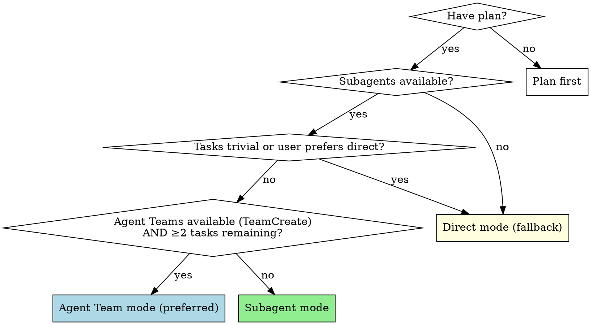
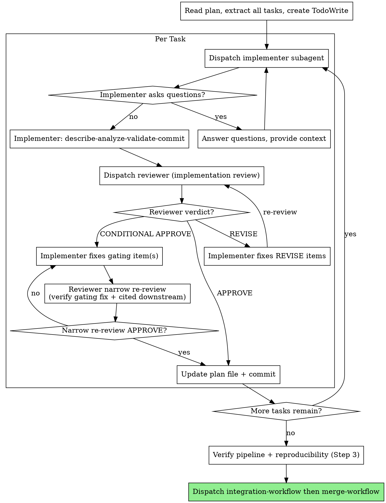

# Execution Workflow

Workflow skill for the **IMPLEMENT** and **VALIDATE** phases of the superRA workflow. Owns per-task dispatch, the implementer-reviewer loop with orchestrator-discipline filtering, end-to-end reproducibility verification, and the 4-option completion menu. On merge/PR, dispatches `superRA:integration-workflow` then `superRA:merge-workflow` directly.

Default mode dispatches a fresh subagent per task. Each task gets one comprehensive review pass whose verdict is APPROVE / REVISE / CONDITIONAL APPROVE; the reviewer walks the active domain skill's §Review & Self-Check Discipline top to bottom (for data analysis: `econ-data-analysis/SKILL.md §Review & Self-Check Discipline`). Falls back to direct execution when the user requests it or tasks are trivial.

**Core principle:** Fresh subagent per task + one comprehensive review pass = high quality, reproducible work. Review always happens regardless of execution mode.

**Announce at start:** "I'm using the execution-workflow skill to implement this plan."

## Execution Modes



**Agent Team mode (preferred):**
- Use `TeamCreate` to set up a persistent team with implementer + reviewer
- Direct iteration between agents without orchestrator relay
- See `superRA:agent-orchestration` §Integration and `references/agent-teams.md` for spawn mechanics; composition is derived from the manifest — one teammate per stage this workflow runs
- Use when: `TeamCreate` tool is available AND ≥2 tasks remain

**Subagent mode:**
- Dispatch implementer subagent per task
- One comprehensive review pass after each (verdict: APPROVE / REVISE / CONDITIONAL APPROVE)
- Fresh context per task (no pollution)
- Orchestrator preserves context for coordination

**Direct mode (fallback):**
- Main agent implements tasks directly
- Still dispatches reviewer subagents after each task (review is never skipped)
- Use when: user explicitly requests it, single trivial task, or platform lacks subagents

## The Process



### Step 0: Branch Check

Before any handoff-doc check, dispatch, or commit, check if on a default branch:

```bash
git branch --show-current
```

If on `main` or `master`:
```
You're on main. I recommend creating a feature branch for this work:
  git checkout -b analysis/<topic>
Want me to create one?
```

If the user declines, proceed — they've given explicit consent to work on the default branch.

### Step 0b: Handoff-Doc Existence Check

After the branch check, confirm `PLAN.md` and `RESULTS.md` exist, are tracked, **and** have no uncommitted modifications (neither unstaged nor staged):

```bash
[ -f PLAN.md ] && [ -f RESULTS.md ] \
  && git ls-files --error-unmatch PLAN.md RESULTS.md >/dev/null 2>&1 \
  && git diff --quiet -- PLAN.md RESULTS.md \
  && git diff --quiet --cached -- PLAN.md RESULTS.md
```

All four conjuncts must succeed. The first two confirm existence and tracking; the last two confirm the worktree copy matches the committed copy (neither a dirty edit nor a staged-but-uncommitted change). A silent pass on dirty state would let execution proceed against a handoff doc that does not actually match what is in git history — exactly the out-of-doc state Workflow Principle 2 forbids.

If the check fails (one or both missing, present but untracked, or present with uncommitted edits), the user probably entered this workflow without going through `planning-workflow` first — for example, they exited CLI plan-mode and jumped straight to execution, inherited an existing branch that never bootstrapped docs, or left in-flight edits uncommitted.

**If the check fails, halt execution-workflow and invoke `superRA:planning-workflow` to bootstrap the docs.** Do not inline planning-workflow content here — the docs are created through planning-workflow's full Phase 1 / Phase 2 / Self-Review (with any applicable domain-specific planning gate satisfied there, not here). Resume execution-workflow at Step 1 after planning-workflow completes; its own self-review and execution-handoff will return control here.

Step 0 (branch check) must have already run and granted consent to commit on the current branch — Step 0b intentionally comes after Step 0 so planning-workflow's bootstrap commits cannot silently land on `main` / `master`.

If the docs exist, are tracked, and the worktree is clean, proceed directly to Step 1.

### Step 1: Load and Review Plan

1. Read `PLAN.md` and `RESULTS.md`.
2. **Load the active domain skill(s) PLAN.md identifies.** For data analysis, this is `superRA:econ-data-analysis` (plus `references/notebook-format.md` when analysis scripts are being written or reviewed). Any task-specific helper skills named in PLAN.md's header or implied by the methodology — load those too. As orchestrator you make dispatch decisions, adjudicate reviewer feedback, and route between Step 2 sub-steps — you cannot do any of that competently without the discipline the domain skill encodes. The implementer and reviewer subagents load these same skills per `superRA:using-superRA` §Skill-Load Manifest at dispatch time, but the orchestrator loads them in-session because orchestrator judgment happens outside any subagent.
3. **Read the project's guidance docs.** The harness gives you the repo-root `CLAUDE.md` automatically; module-level guidance (nested `CLAUDE.md` / `AGENTS.md` / `README.md` files near the code) is not auto-surfaced. Walk up from every directory PLAN.md says will be touched, and `Read` every `CLAUDE.md` / `AGENTS.md` / `README.md` along the path. Also read `README.md` in any data directory the plan loads from, for provenance and caveats. These docs carry the conventions you will use when adjudicating reviewer findings ("is this a codebase-fit issue the reviewer correctly flagged, or noise?") and when editing upcoming tasks inline. This mirrors the walk-up the implementer and reviewer subagents perform at dispatch — the orchestrator does the same walk once, not per-task.
4. Review PLAN.md critically — identify any questions or concerns:
   - Are data sources / inputs available and accessible?
   - Are the steps in the right order?
   - Is the pipeline file included (for multi-script analyses)?
   - Does any step conflict with a project convention you found in step 3?
5. Review RESULTS.md for context on any completed steps (if resuming).
6. If concerns: raise them with your human partner before starting.
7. If no concerns: create TodoWrite with all steps and proceed.

### Step 2: Execute Tasks

#### Per-Task Execution Steps

1. **Dispatch implementer.** Subagent mode: `Agent(subagent_type: "superRA:implementer")` — see template below. Direct mode: follow `superRA:using-superRA` §Execution Modes, then implement yourself. See `superRA:agent-orchestration` §Agent reuse vs fresh dispatch for when to reuse a warm implementer via `SendMessage` versus spawning a fresh dispatch.
2. **If NEEDS_CONTEXT or BLOCKED:** provide context and re-dispatch (see Handling Implementer Status below).
3. **Once DONE or DONE_WITH_CONCERNS:** the implementer has already committed code + PLAN.md (`IMPLEMENTED`) + RESULTS.md. **Dispatch the reviewer (one comprehensive pass).** The reviewer walks the active domain skill's §Review & Self-Check Discipline top to bottom and returns one of three verdicts:
   - **APPROVE** — no findings. Proceed to the next task.
   - **REVISE** — only `[STANDARD]` items failed. Adjudicate feedback in place inside the PLAN.md review-notes blockquote — append `→ orchestrator: rejected <reason>` or `→ orchestrator: <second opinion requested> <reason>` annotations to items you are rejecting or flagging, rewrite task steps in place for items you are accepting, commit, then re-dispatch the implementer. Leave the blockquote itself intact — the implementer will annotate items with `→ implemented: ...` markers on their pass, and the reviewer will delete confirmed-fixed items on re-review. See the "Handling Reviewer Feedback" section below and `agents/implementer.md` / `agents/reviewer.md` for the full annotation mechanics. Iterate until APPROVE.
   - **CONDITIONAL APPROVE** — one or more `[GATING]` items failed, but the reviewer walked downstream items and they look correct conditional on the gating fix not invalidating them. Adjudicate the flagged gating item(s) the same way (accept / reject / second opinion), then re-dispatch the implementer to fix them. The reviewer's re-dispatch on a CONDITIONAL APPROVE is **narrow by default**: it verifies the gating fix is correct and that the cited downstream items still hold under the fix; if both pass, it promotes to unconditional APPROVE. MAY dispatch a wider re-review via optional `Additionally:` steering when the gating fix is substantial enough to cast doubt on downstream items — documented flexibility, not the default.
4. **Once APPROVE:** the reviewer has committed `APPROVED` to PLAN.md. Check whether the review report cites specific files and lines — a substantive APPROVE describes what was verified. A generic APPROVE with no file citations is a red flag: re-dispatch the reviewer with an instruction to cite the key code paths it examined. If findings change upcoming tasks, update future task descriptions in PLAN.md and commit. Proceed to next task.

**In direct mode:** Steps 1–2 are done by the main agent directly (follow `superRA:using-superRA` §Execution Modes). Steps 3–4 are unchanged — still dispatch reviewer subagents.

#### Dispatch Templates

See `superRA:agent-orchestration` §Dispatch Templates for the canonical shape (required fields first, `Additionally:` anchor last; the "Follow the standard stage-relevant workflow" prefix; banned-in-dispatch list). Both implementer and reviewer dispatches in this workflow use `Stage: implementation` — the `subagent_type` (`superRA:implementer` vs `superRA:reviewer`) carries the role split. On a CONDITIONAL APPROVE re-dispatch, the same reviewer template is used with `Additionally:` pointing at the narrow scope: "Narrow re-review — verify the gating fix at <file:line> and confirm cited downstream items still hold."

#### Handling Reviewer Feedback (Orchestrator Discipline)

See `superRA:agent-orchestration` §Handling Reviewer Feedback (Orchestrator Discipline).

### Step 3: Verify Pipeline and Reproducibility

After every task is APPROVED, verify the work end-to-end before presenting completion options. This is an **orchestrator skeleton** — the domain-specific gating items live in the active domain skill's §Completion verification (for data analysis: `econ-data-analysis/SKILL.md §Review & Self-Check Discipline §Completion verification`). Walk all five checks; do not proceed if any fails.

**Run every check. Don't trust "looks committed" — execute `git status` and read the output. The five checks below are the orchestrator's verification gate: evidence before claims, no shortcuts.**

1. **All code committed?**
   ```bash
   git status
   ```
   If uncommitted changes exist: investigate (probably an agent missed an inline-edit), commit, or ask the user.

2. **PLAN.md up to date?** All tasks have `**Review status:** APPROVED`. All steps marked `- [x]` with result notes. No tasks stuck in `IMPLEMENTED`, `REVISE`, or `CONDITIONAL APPROVE`. Discovery notes captured. Upcoming-task descriptions reflect current understanding.

3. **RESULTS.md up to date?** Has findings for all completed tasks. Figure attachments in `results_attachments/` committed.

4. **Domain completion verification.** Walk the active domain skill's §Completion verification `[GATING]` items. For data analysis, this is `econ-data-analysis/SKILL.md §Review & Self-Check Discipline §Completion verification` — pipeline runs end-to-end if the plan declares one, outputs exist and were generated from committed code (not ad-hoc REPL), and any other domain-specific gating items. The domain skill owns the exact list; this workflow just routes you to it.

5. **Deferred MINORs resolved?** Check PLAN.md review-notes blockquotes for any remaining MINOR items. If a MINOR was deferred across tasks and never addressed, resolve it now (dead code removal, missing documentation, format compliance) or document it as an accepted limitation in RESULTS.md.

If any check fails: fix it before proceeding. Do not present completion options for unreproducible work.

### Step 4: Determine Base Branch and Present Options

**Base branch:** resolve from git first; only stop and ask if git can't tell you.
```bash
git merge-base HEAD main 2>/dev/null || git merge-base HEAD master 2>/dev/null
```
If the branch point is ambiguous, ask via `AskUserQuestion` (question: "Which base branch did this analysis split from?", options: `main`, `master`, other). Plain-text fallback: "This branch split from `main` — is that correct?"

**Present the 4 completion options via `AskUserQuestion` when the tool is available.** This is a legitimate user-defined milestone — the agent has driven the work to an `APPROVED` + reproducible state on its own power, and the next step is the researcher's call. Frame the question as "Work complete and verified. What would you like to do with this branch?" with the four options below; each option also gets a short description so the researcher does not have to re-derive what each one means. When `AskUserQuestion` is unavailable, fall back to the plain-text form.

```
Work complete and verified. What would you like to do?

1. Merge back to <base-branch> locally
2. Push and create a Pull Request
3. Keep the branch as-is (I'll handle it later)
4. Discard this work
```

Log the researcher's answer per `using-superRA` §Handoff Doc Discipline §User Decisions Log — top-level `## Decisions` section, before executing the choice, included in the first commit of whatever workflow the option dispatches to.

**Execute the user's choice:**

- **Option 1 or 2 (Merge or PR):** 
  Invoke `superRA:integration-workflow` skill to proceed with the integration stage. 

  - **Option 3 (Keep as-is):** Report the branch name and worktree path back to the user, then stop. Do not clean up.
- **Option 4 (Discard):** Confirm with the user by typed input — they must type the word `discard` exactly. Then:
  ```bash
  git checkout <base-branch>
  git branch -D <analysis-branch>
  git worktree remove <worktree-path>  # only if running in a worktree
  ```
  Stop after the branch and worktree are removed. Report what was deleted.

## Review Status Reference

See `superRA:agent-orchestration` §Review Status Reference.

### Orchestrator-Only Responsibilities

These are the things the orchestrator does that no subagent does:

- **Task sequencing and dispatch.** Read PLAN.md, decide what to dispatch next.
- **Adjudicate reviewer feedback in place** in the PLAN.md review-notes blockquote before re-dispatching the implementer (see Handling Reviewer Feedback above). Append `→ orchestrator: rejected <reason>` annotations to items you are rejecting, `→ orchestrator: <second opinion requested> <reason>` to items you are flagging for the reviewer, and rewrite task steps in place for items you are accepting. **Do not clear the blockquote.** The implementer appends `→ implemented: ...` annotations on their pass; the reviewer deletes confirmed-fixed items on re-review. See `agents/implementer.md` §"How You Fix Review Items on a REVISE Round" and `agents/reviewer.md` §"How You Write a Review" for the full annotation mechanics. Commit the annotated PLAN.md.
- **Edit future tasks inline** when findings from a completed task change the upcoming plan — rewrite stale text, don't annotate it. Commit.
- **Escalate to the researcher via `AskUserQuestion`** (plain text if unavailable) when stuck: BLOCKED, methodology disagreement, CRITICAL issue you want to override, repeated reviewer disagreement. Log per `using-superRA` §Handoff Doc Discipline §User Decisions Log.

**Review scope at interim checkpoints:** Per-task correctness only (as defined by the active domain skill's §Review & Self-Check Discipline). Codebase integration review is deferred to integration-workflow (dispatched by this skill at Step 4 when the user chooses merge or PR).

## Model Selection

Use the least capable model that handles the task; reviewers use the most capable available model. Domain-specific complexity examples live in the domain skill, not here.

## Handling Implementer Status

**DONE:** Proceed to review.

**DONE_WITH_CONCERNS:** Read the concerns. If about input quality or unexpected findings, investigate before review. If about methodology choices, note and proceed to review.

**NEEDS_CONTEXT:** Provide missing upstream inputs, documentation, or methodology details and re-dispatch.

**BLOCKED:** Assess the blocker:
1. Required input not available → help locate or download
2. Input quality too poor → escalate via `AskUserQuestion`, log answer in PLAN.md before proceeding
3. Task requires methodology decisions → escalate via `AskUserQuestion`, log answer in PLAN.md before proceeding
4. Task too complex → break into smaller pieces or use more capable model

## Autonomy and Stop Points

The autonomy contract (proceed-without-asking patterns, stop-and-ask classes, banned phrasings) is in `superRA:using-superRA/references/main-agent-autonomy.md` — main-agent only. Read it at session start; it applies to every workflow phase, not just execution. This section lists only the **execution-workflow-specific stop points** — the legitimate pauses baked into this workflow that plug into the autonomy contract's three pause classes.

- **Step 4 completion menu.** The 4-option menu (merge now / continue another task / sensitivity task / discard) is a user-defined workflow milestone.
- **Hard blockers from domain signals.** Unexpected input-quality issues during initial description, scope changes from a merge (row count shifts), validation failure against domain expectation, plan with critical gaps, pipeline file missing for a multi-script analysis, required input unavailable. Pause class (1) in the autonomy contract.
- **Methodology / authority boundary decisions.** Methodology disagreement with a reviewer, CRITICAL severity issue the orchestrator wants to override, repeated reviewer disagreement across re-dispatches on the same point, validation failure of unclear domain significance, scope or definition call with no obvious right answer. Pause class (2) in the autonomy contract.

Every stop above: stop and `AskUserQuestion` (plain text if unavailable); log per `using-superRA` §Handoff Doc Discipline §User Decisions Log **before** acting on it.

## Agent Loads

See `superRA:using-superRA` §Skill-Load Manifest — it is the single source of truth for what every dispatched implementer / reviewer loads per Stage. This workflow runs the `implementation` row for both roles; `subagent_type` (`superRA:implementer` vs `superRA:reviewer`) carries the role split.

## Agent Teams Mode

When Agent Teams are available (`CLAUDE_CODE_EXPERIMENTAL_AGENT_TEAMS`), the per-task implementation+review cycle can be orchestrated as a persistent team — direct iteration between implementer and reviewer without the orchestrator relaying feedback. See `superRA:agent-orchestration` §Integration and `references/agent-teams.md` for spawn mechanics. Composition is derived from the manifest — one teammate per stage this workflow runs.

**Critical:** When all tasks complete, shut down teammates and clean up the team BEFORE dispatching `superRA:integration-workflow`. This frees the session's team slot for the integration-workflow team and the subsequent merge-workflow team.

## Red Flags

**Never:**
- Start work on main/master branch without proposing a feature branch first (Step 0)
- Skip review — even in direct mode
- Proceed with unfixed `[GATING]` items (a CONDITIONAL APPROVE task is not complete until the narrow re-review promotes it to APPROVED)
- Dispatch multiple implementers in parallel on the same working tree (conflicts)
- Paraphrase the task prompt into the dispatch instead of pointing the subagent at `PLAN.md` (the pointer-based convention is mandatory — subagents read the file directly so the dispatch and PLAN.md cannot drift)
- Skip plan file update after task completion
- Ignore implementer input-quality or methodology concerns
- Accept "looks fine" without verification
- Move to the next task while the current task's review has open issues or status is not APPROVED

**If reviewer returns REVISE or CONDITIONAL APPROVE:**
- Adjudicate in the review-notes blockquote first (see Handling Reviewer Feedback)
- Re-dispatch the implementer with the adjudicated items
- Re-dispatch the reviewer after implementer fixes (narrow re-review on CONDITIONAL APPROVE)
- Repeat until APPROVED
- Do NOT skip the re-review
- Do NOT ask the user whether to fix — iterate automatically

## Integration

**Required workflow skills:**
- **superRA:using-analysis-worktrees** — RECOMMENDED: For complex or multi-session analyses, set up an isolated workspace before starting
- **superRA:worktree-data-sync** — Load this when copying managed data between existing worktrees (e.g., seeding a new analysis worktree from the main one); do not hand-roll data copy scripts
- **superRA:planning-workflow** — Creates the plan this skill executes
- **the active domain skill (for data analysis: `superRA:econ-data-analysis`)** — REQUIRED: domain discipline all agents follow, loaded at dispatch-time per `superRA:using-superRA` §Skill-Load Manifest. Carries the §Review & Self-Check Discipline that the reviewer walks on every pass.
- **superRA:integration-workflow** — Drift tests, refactor-review loop, documentation finalization (dispatched by this skill at Step 4 on merge/PR)
- **superRA:merge-workflow** — Main update, post-merge verification, local merge or PR push, worktree cleanup (dispatched by this skill at Step 4 on merge/PR after integration-workflow returns)
