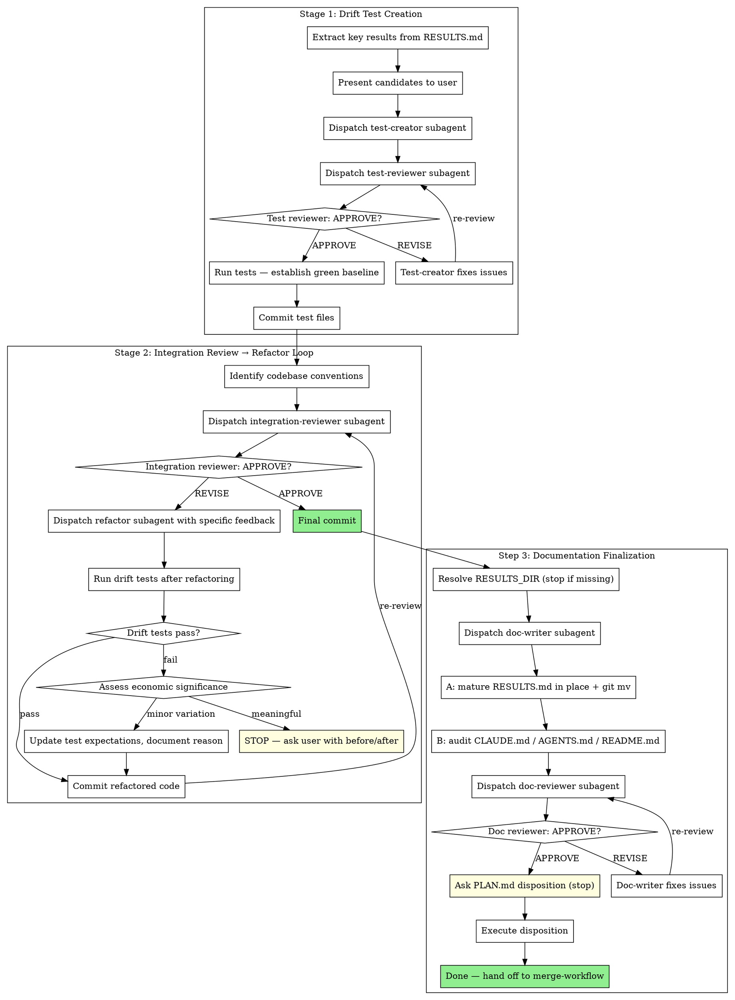

# Integration Workflow

Workflow skill for the **INTEGRATE** phase of the superRA workflow. Owns the three steps that prepare an analysis branch for merging into main: protect results with drift tests (Stage 1), refactor code for codebase integration (Stage 2), and finalize all documentation for merge — mature RESULTS.md into its Stage 2 permanent form, audit project-level docs (CLAUDE.md / AGENTS.md / README.md), and dispose of PLAN.md (Step 3). Hands off the actual merge/PR mechanics to `superRA:merge-workflow`.

Assumes execution-workflow has already verified reproducibility and the user has chosen Option 1 (merge locally) or Option 2 (push + PR). If you find yourself running reproducibility checks or presenting the 4-option menu, something is wrong: that work belongs in execution-workflow.

**Core principle:** Tests guard results. Integration review identifies what needs changing. Refactoring addresses specific issues. Before merge, every doc lands in its final form through a dedicated doc-writer + doc-reviewer pair: RESULTS.md matures from dev log into a permanent co-located record, project docs are brought into sync with the new code, and PLAN.md is disposed of. Nothing hands off to merge-workflow without integration reviewer approval on the refactored code (Stage 2) AND doc-reviewer approval on the matured RESULTS.md + project docs (Step 3).

**Announce at start:** "I'm using the integration-workflow skill to prepare this work for integration."

**Autonomy:** this workflow has exactly four legitimate stop points — drift-test candidate confirmation (Stage 1 Step 2), meaningful drift escalation after refactoring (Stage 2 / "Handling Drift Test Failures"), Stage 2 RESULTS.md relocation target if project guidance does not specify one (Step 3 sub-part A), and PLAN.md disposition (Step 3 sub-part C). Between those, run on your own power: do not check in after each stage, do not ask "ready to move to the next step?", do not re-confirm a reviewer's APPROVE. See CLAUDE.md workflow principle #4 for the full autonomy rule and `handoff-doc` §User Decisions Log for how the answer at each stop point must be recorded in PLAN.md before the workflow acts on it.

## The Process



## Dispatch Convention

Every dispatch in this skill uses the pointer-based template — pass only the stage label, the domain reference path, and any task-specific pointers (key results, code under review, prior reviewer findings). The `implementer` and `reviewer` agent definitions own the report format, handoff protocol, and skill-load defaults; do not duplicate that content into the dispatch prompt. Stage-driven auto-loads (including the domain skill and any stage-scoped references) are defined in `agents/implementer.md` / `agents/reviewer.md` Stage tables — dispatches do not restate them.

When a reviewer returns REVISE in either stage, **adjudicate the feedback before forwarding it.** See "Handling Reviewer Feedback (Orchestrator Discipline)" in `superRA:execution-workflow` for the protocol — the same discipline applies here. You are the senior researcher; the reviewer is an advisor. Read the cited code, classify each issue, override with documented reasoning if the reviewer is wrong, push back with counter-evidence if the reviewer misread the code.

## Stage 1: Drift Test Creation

Drift tests guard key results from unintended changes during refactoring or future modifications. They are the safety net that makes refactoring safe.

### Steps

1. **Extract key results from RESULTS.md.** Read the results document and use economic reasoning to identify KEY results -- main findings that define the analysis conclusions, not every intermediate number.

2. **Present candidates to user via `AskUserQuestion`** (plain text if unavailable). This is a legitimate stop point — drift-test coverage is a researcher-owned decision because it encodes what counts as a "key result" worth protecting. Show the candidates with their values and let the researcher confirm, add, or remove:
   ```
   These results seem like the key findings to protect with drift tests:
   - [result 1: description and value]
   - [result 2: description and value]
   - ...

   Which of these should be protected? Any to add or remove?
   ```
   The answer is a user decision — log it in the top-level `## Decisions` section of `PLAN.md` (or inside the task block whose results are being protected, if the list is task-scoped) per `handoff-doc` §User Decisions Log, and commit the PLAN.md edit **before** dispatching the test-creator. The `ask-user-question-logger` hook will remind you.

3. **Dispatch test-creator:**
   ```
   Agent(subagent_type: "superRA:implementer"):
     Stage: drift test creation
     Skills: superRA:refactor-and-integrate
     Domain references: drift-test-quality.md (refactor-and-integrate) + integrate-drift-tests.md (econ-data-analysis)
     Key results to protect: [user-confirmed list with values]
     Test conventions: [project test framework, test directory]
     Additionally: Follow the standard stage-relevant workflow and load
       relevant skills and documents to proceed. Additionally,
       <optional steering — e.g., tolerance conventions specific to this
       analysis, prior-round adjudication if this is a re-dispatch>.
   ```

4. **Dispatch test-reviewer:**
   ```
   Agent(subagent_type: "superRA:reviewer"):
     Stage: drift test
     Skills: superRA:refactor-and-integrate
     Domain references: drift-test-quality.md (refactor-and-integrate) + integrate-drift-tests.md (econ-data-analysis)
     Tests under review: [paths to created test files]
     Key results they should protect: [list]
     Additionally: Follow the standard stage-relevant workflow and load
       relevant skills and documents to proceed. Additionally,
       <optional steering>.
   ```

5. **If REVISE:** adjudicate the reviewer's issues per the orchestrator discipline above. For accepted issues, re-dispatch the test-creator with the specific feedback. Re-dispatch the test-reviewer. Iterate until APPROVE.

6. **Run tests to establish green baseline.** All drift tests must pass on the current code before proceeding. If tests fail on the existing code, the tests are wrong -- fix them.

7. **Commit test files.**
   ```bash
   git add tests/
   git commit -m "add drift tests for key analysis results"
   ```

## Stage 2: Integration Review → Refactor Loop

The integration reviewer is the gatekeeper. Review first to identify what needs changing, then refactor to address specific issues. Nothing moves forward without integration reviewer approval.

### Steps

1. **Identify existing codebase conventions.** Read:
   - CLAUDE.md, AGENTS.md, or project configuration for coding standards
   - Existing code in the repository for naming patterns, file organization, utility functions
   - Available utility functions that the new code should adopt

2. **Dispatch integration-reviewer:**
   ```
   Agent(subagent_type: "superRA:reviewer"):
     Stage: integration review
     Skills: superRA:refactor-and-integrate
     Domain reference: active domain skill's §Refactor integrity (for data analysis: `econ-data-analysis/SKILL.md` §Review & Self-Check Discipline §Refactor integrity) + codebase-integration.md (cross-cutting code-quality checklist)
     Code under review: [paths]
     Codebase conventions: [where they're documented — CLAUDE.md, AGENTS.md, etc.]
     Drift tests: [paths]
     Diff: <BASE_SHA>..<HEAD_SHA>
     Additionally: Follow the standard stage-relevant workflow and load
       relevant skills and documents to proceed. Additionally,
       <optional steering>.
   ```

3. **If APPROVE:** No refactoring needed. Proceed to final commit.

4. **If REVISE:** Adjudicate the reviewer's feedback per the orchestrator discipline above. For accepted issues, refactor:

   a. **Dispatch refactorer:**
      ```
      Agent(subagent_type: "superRA:implementer"):
        Stage: refactoring
        Skills: superRA:refactor-and-integrate
        Domain reference: active domain skill's §Refactor integrity (for data analysis: `econ-data-analysis/SKILL.md` §Review & Self-Check Discipline §Refactor integrity) + codebase-integration.md (cross-cutting code-quality checklist)
        Reviewer issues to address: [accepted items, file:line, what to fix]
        Codebase conventions: [pointers]
        Drift tests: [paths — must keep passing]
        Code to refactor: [paths]
        Additionally: Follow the standard stage-relevant workflow and load
          relevant skills and documents to proceed. Additionally,
          <optional steering — e.g., prior-round adjudication, items the
          orchestrator has rejected vs. accepted>.
      ```

   b. **After refactoring: run drift tests.**
      - **Pass:** Commit and re-submit for review.
      - **Fail:** Assess economic significance of the drift.
        - **Meaningful drift** (results change substantively): STOP. Show the user before/after values and ask how to proceed. Do not silently accept changed results.
        - **Minor variation** (rounding, floating-point, inconsequential magnitude change): Update test expectations with the new values, document the reason in a comment, and proceed.

   c. **Commit refactored code.**
      ```bash
      git add -A
      git commit -m "refactor analysis code for codebase integration"
      ```

   d. **Re-dispatch integration-reviewer.** Loop back to step 2. Iterate until APPROVE.

5. **Final commit** after integration reviewer APPROVE.
   ```bash
   git add -A
   git commit -m "address integration review feedback"
   ```

## Step 3: Documentation Finalization

After Stage 2 APPROVES the refactored code, every doc needs to land in its final shape before merge: `RESULTS.md` matures from dev log to permanent record, project-level docs (`CLAUDE.md` / `AGENTS.md` / `README.md`) are brought into sync with the new code, and `PLAN.md` is disposed of. This step gates the entire documentation pass behind a **single implementer-reviewer pair** — a dispatched doc-writer subagent performs sub-parts A and B, a dispatched doc-reviewer subagent gates both together, and the orchestrator handles the user-facing decisions (relocation target, PLAN.md disposition) on either side of the subagent cycle.

Why a doc-writer subagent and not orchestrator-performed: workflow principle P1 requires an enforced implementer-reviewer pair at every step. Having the orchestrator do the consolidation and then dispatching only a reviewer is a reviewer-only gate, not a pair. The doc-writer subagent closes that gap and keeps Step 3 consistent with the rest of the workflow.

The format discipline for sub-part A lives entirely in `superRA:report-in-markdown`. This step orchestrates and dispatches; it does not duplicate the rules.

### Orchestrator preamble: resolve RESULTS_DIR

The matured `RESULTS.md` lands in the analysis's permanent code folder, **per project guidance**. Before dispatching the doc-writer, read `CLAUDE.md`, `AGENTS.md`, or the project README for the convention. If none exists, this is a legitimate stop point — ask the researcher via `AskUserQuestion` (plain text if unavailable):

```
Stage 2 RESULTS.md needs a permanent location in this project. The matured
file will be co-located with the analysis code so it travels with it.
Where should it land?

Suggested: <best guess from the analysis code's location, e.g. analyses/<name>/>
```

Log the answer in the top-level `## Decisions` section of `PLAN.md` per `handoff-doc` §User Decisions Log **before** dispatching the doc-writer. If a project convention exists in the guidance files, use it directly without asking. The `ask-user-question-logger` hook will remind you.

Define `RESULTS_DIR` = the resolved permanent folder. Define `RESULTS_ATTACHMENTS_DIR` = `${RESULTS_DIR}/attachments` (destination for materialized figures, distinct from the worktree-root `results_attachments/` that the analysis script writes to). Pass both as dispatch parameters.

### Dispatch the doc-writer

```
Agent(subagent_type: "superRA:implementer"):
  Stage: documentation finalization (Stage 2 RESULTS.md + project doc audit)
  Skills: superRA:report-in-markdown
  Domain references: baseline-io.md + rich-content.md + final-form.md (full mode)
  RESULTS_DIR: <resolved permanent folder>
  RESULTS_ATTACHMENTS_DIR: ${RESULTS_DIR}/attachments
  Stage 1 RESULTS.md: RESULTS.md (at worktree root)
  PLAN.md: PLAN.md (for objective, methodology, citations)
  Diff: <BASE_SHA>..<HEAD_SHA>
  Code files cited by RESULTS.md: [paths]
  Output files cited by RESULTS.md: [paths]
  Sub-parts (execute in order, commit each separately):
    A. Mature RESULTS.md in place, relocate to ${RESULTS_DIR} per final-form.md
    B. Audit project docs reachable from the diff (walk up to each CLAUDE.md /
       AGENTS.md / README.md from every changed file; always also check root
       README.md and root CLAUDE.md). Update stale claims, add new patterns,
       create missing CLAUDE.md + AGENTS.md symlink pair for new modules.
  Additionally: Follow the standard stage-relevant workflow and load
    relevant skills and documents to proceed. Additionally,
    <optional steering — e.g., project-specific doc conventions, prior-round
    doc-reviewer feedback on a re-dispatch>.
```

The doc-writer is the only subagent in this step. It loads `superRA:report-in-markdown` full mode (SKILL.md + all three references) and performs both sub-parts before returning control.

#### Sub-part A: Mature RESULTS.md in place

Drive from `final-form.md`. The pass typically does:

1. Restructure from task-indexed to reader-facing — by objective, data source, or result type. Task numbering disappears.
2. Merge related findings split across tasks.
3. Strip resolved reviewer caveats; surface unresolved limitations into a "Limitations" section.
4. Add frontmatter per `baseline-io.md`. The file name stays `RESULTS.md` across stages — it is the identity of the artifact.
5. Materialize figures from `results_attachments/` into `${RESULTS_ATTACHMENTS_DIR}` per `rich-content.md`. Update embed paths.
6. Run the fact-check checklist from `final-form.md`. Open every cited file and confirm the claim matches. Strip speculation and subjective language. Remove prohibited sections (Recommendations, Conclusions, Implications) unless the researcher explicitly requested them.
7. Relocate: `git mv RESULTS.md ${RESULTS_DIR}/RESULTS.md` and `git mv` (or copy + remove) the materialized attachments folder into place.

Commit sub-part A separately:
```bash
git add ${RESULTS_DIR}/RESULTS.md ${RESULTS_DIR}/attachments/
git commit -m "mature RESULTS.md into permanent form at ${RESULTS_DIR}"
```

#### Sub-part B: Project documentation audit

For every file in the diff `<BASE_SHA>..<HEAD_SHA>`, walk up from its directory to the repo root and collect every `CLAUDE.md` / `AGENTS.md` / `README.md` encountered. Always also check the repo-root `README.md` and root `CLAUDE.md` regardless of the diff (stale skill counts and top-level claims live there).

For each doc in the set:

- **Update stale claims** — command names, file paths, architectural notes, skill counts, any statement contradicted by the diff.
- **Add new patterns or modules** — if the diff introduced a new module directory, feature, or command, document it at the correct level (nearest CLAUDE.md to the new code, not blasted into parent docs).
- **Do not duplicate parent-level content** — link instead. Module-level docs should carry module-specific conventions, not repeat what repo-root docs already cover.
- **Create missing CLAUDE.md + AGENTS.md pair for new modules** — if a new module directory has no guidance doc, create `CLAUDE.md` with purpose/conventions, then create a relative symlink `AGENTS.md -> CLAUDE.md` (just the filename, not an absolute path). If only one of the pair exists in an existing directory, unify them via symlink (keep the richer file).

Do **not** propagate upward for the sake of it: leave `CLAUDE.md` / `AGENTS.md` above the affected area alone unless something in them is stale.

Commit sub-part B separately:
```bash
git add -A
git commit -m "update project docs for <analysis>"
```

### Dispatch the doc-reviewer

After both sub-parts commit, dispatch the reviewer:

```
Agent(subagent_type: "superRA:reviewer"):
  Stage: documentation finalization (Stage 2 RESULTS.md + project doc audit)
  Skills: superRA:report-in-markdown
  Domain reference: final-form.md
  Matured document under review: ${RESULTS_DIR}/RESULTS.md
  Project docs under review: [CLAUDE.md / AGENTS.md / README.md files touched by sub-part B]
  Source dev log (for comparison): RESULTS.md at <PRE_MATURE_SHA>
  Diff: <BASE_SHA>..<HEAD_SHA>
  Code files cited: [paths]
  Output files cited: [paths]
  Objective of the analysis: [from PLAN.md header]
  Additionally: Follow the standard stage-relevant workflow and load
    relevant skills and documents to proceed. Additionally,
    <optional steering>.
```

The reviewer loads `superRA:report-in-markdown` SKILL.md + `final-form.md` (and only those — per the skill's load-map for the doc-reviewer role). Scope:

1. **Matured RESULTS.md** — run the fact-check checklist line by line (`final-form.md`). Every cited number must match its source. Prohibited language, unsupported claims, and disallowed sections block APPROVED.
2. **Project docs** — accuracy against the diff, no stale claims remain, new features documented at the right level, no duplication with parent `CLAUDE.md`, CLAUDE.md ↔ AGENTS.md symlink convention respected.
3. **Cross-consistency** — matured `RESULTS.md` and any `README.md` / `CLAUDE.md` that mentions the analysis do not contradict each other (figures of merit, method names, sample sizes).

If REVISE: adjudicate per the orchestrator discipline above. For accepted issues, re-dispatch the doc-writer with specific feedback (file:line, what to fix). Re-dispatch the doc-reviewer. Iterate until APPROVE.

### Sub-part C: Dispose of PLAN.md (orchestrator, after APPROVE)

Once the doc-reviewer APPROVES sub-parts A and B, the orchestrator handles PLAN.md disposition directly — this is a user-facing decision, not an RA-implementable task, and it must not be delegated.

By this point `RESULTS.md` has graduated to `${RESULTS_DIR}` and project docs are in sync. `PLAN.md` is the only Stage 1 scaffold left at the worktree root, along with the working `results_attachments/` folder (whose content has already been materialized into `${RESULTS_ATTACHMENTS_DIR}`).

Ask via `AskUserQuestion` (plain text if unavailable) — this is a legitimate stop point. The default suggestion is Option 1 (move alongside the matured RESULTS.md):

```
PLAN.md is still at the worktree root and needs disposition. RESULTS.md
has already been matured and committed at ${RESULTS_DIR}, and project docs
are up to date. Options:

1. Move PLAN.md (and results_attachments/) alongside the matured
   RESULTS.md at ${RESULTS_DIR} — keeps the prescriptive history with
   the analysis code (recommended).
2. Consolidate any plan context into existing project documentation,
   then delete PLAN.md and results_attachments/.
3. Delete PLAN.md and results_attachments/ — git history preserves
   them on this branch.

Which option?
```

Log the researcher's choice in the `## Decisions` section of `PLAN.md` **before** executing the disposition (per `handoff-doc` §User Decisions Log). Include the log entry in the same commit that moves or removes the files — the last state of `PLAN.md` records what was done with it.

**Option 1 (Move alongside matured RESULTS.md):**
```bash
git mv PLAN.md ${RESULTS_DIR}/
git mv results_attachments/ ${RESULTS_DIR}/source_attachments/ 2>/dev/null
git commit -m "move analysis plan to ${RESULTS_DIR}"
```
The `results_attachments/` folder is renamed `source_attachments/` at the destination so it does not collide with the matured RESULTS.md's `attachments/` folder (which holds the materialized copies). Skip the rename if there are no figures.

**Option 2 (Consolidate):**
- Identify which existing project documentation should pick up plan context (data inventory, methodology rationale).
- Merge into existing docs (the researcher guides which docs).
- Remove the originals:
```bash
git rm PLAN.md
rm -rf results_attachments/
git add -A results_attachments/ 2>/dev/null
git commit -m "consolidate analysis plan context into project docs"
```

**Option 3 (Delete):**
```bash
git rm PLAN.md
rm -rf results_attachments/
git add -A results_attachments/ 2>/dev/null
git commit -m "remove analysis plan (preserved in branch history)"
```

## Hand-Off to merge-workflow

After Steps 1–3 are complete (drift tests committed, refactoring approved, all docs finalized via the doc-writer + doc-reviewer pair, and PLAN.md disposed of), invoke `superRA:merge-workflow` to update with main, run post-merge verification (drift tests + fresh integration review), and execute the local merge or PR push. Do not attempt the merge mechanics yourself — merge-workflow owns them.

## When to Lighten

**Standalone analysis (no existing codebase to integrate with):**
- Stage 1 (drift tests): Always run. Tests protect results regardless of codebase context.
- Stage 2 (integration review → refactor): Lighter pass -- focus on code quality and clarity rather than codebase convention alignment. Integration reviewer may APPROVE with no refactoring needed.

**Small changes (single-file analysis, few results):**
- Stage 1: Still run, but fewer tests needed.
- Stage 2: Integration reviewer may APPROVE immediately if code is clean.

## Handling Drift Test Failures After Refactoring

This is the critical judgment call in the process. When drift tests fail after refactoring:

1. **Identify what changed.** Compare the before/after values.
2. **Assess economic significance.** Is this a meaningful change in results, or a trivial numerical difference?
   - Point estimates shifting by more than the tolerance you set: investigate.
   - Sign changes or significance changes: always meaningful.
   - Standard errors changing modestly: usually minor (sensitive to implementation details).
3. **If meaningful:** Do not proceed. Show the user exactly what changed — before/after values side by side — and ask via `AskUserQuestion` (plain text if unavailable) whether to (a) accept the new result and update the drift test baseline with a documented reason, (b) roll back the refactoring, or (c) investigate the discrepancy further before deciding. Log the researcher's answer per `handoff-doc` §User Decisions Log before taking any action.
4. **If minor:** Update the test expectation, add a comment explaining why (e.g., "tolerance updated: refactored merge order produces equivalent result within floating-point precision"), and proceed.

## Agent Types and Domain References

Dispatched agents load a parent skill via the `Skills:` line and read a named domain reference by basename (the runtime announces the skill's base directory on load; the agent reads `<base_dir>/references/<basename>`).

| Stage | Agent | Parent skill | Domain reference |
|---|---|---|---|
| Stage 1 test creation | `superRA:implementer` | `superRA:refactor-and-integrate` | `drift-test-quality.md` (quality checklist) + `econ-data-analysis/references/integrate-drift-tests.md` (domain-specific framing: what to protect, econ tolerances, failure modes) |
| Stage 1 test review | `superRA:reviewer` | `superRA:refactor-and-integrate` | `drift-test-quality.md` + `econ-data-analysis/references/integrate-drift-tests.md` |
| Stage 2 refactoring | `superRA:implementer` | `superRA:refactor-and-integrate` | active domain skill's §Refactor integrity (data analysis: `econ-data-analysis/SKILL.md` §Review & Self-Check Discipline §Refactor integrity) + `codebase-integration.md` (cross-cutting code-quality) |
| Stage 2 integration review (code) | `superRA:reviewer` | `superRA:refactor-and-integrate` | active domain skill's §Refactor integrity (data analysis: `econ-data-analysis/SKILL.md` §Review & Self-Check Discipline §Refactor integrity) + `codebase-integration.md` (cross-cutting code-quality) |
| Step 3 doc-writer (matured RESULTS.md + project doc audit) | `superRA:implementer` | `superRA:report-in-markdown` | `baseline-io.md` + `rich-content.md` + `final-form.md` (full mode) |
| Step 3 doc-reviewer (final-form + project docs) | `superRA:reviewer` | `superRA:report-in-markdown` | `final-form.md` |

Step 3 sub-parts A (mature RESULTS.md) and B (project doc audit) are performed by the dispatched doc-writer subagent — an implementer-reviewer pair gates the whole documentation pass per workflow principle P1. Sub-part C (PLAN.md disposition) stays with the orchestrator because it is a user-facing decision, not an RA-implementable task.

Stage-driven domain-skill and script-to-notebook auto-loads are defined in the `agents/implementer.md` and `agents/reviewer.md` Stage tables (for data-analysis stages, those tables auto-load `superRA:econ-data-analysis` and `superRA:script-to-notebook`).

## Agent Teams Mode

When Agent Teams are available (`CLAUDE_CODE_EXPERIMENTAL_AGENT_TEAMS`), Stages 1 and 2 can be orchestrated as a team instead of sequential subagent dispatches. This enables direct iteration between creator/reviewer and integration-reviewer/refactorer without the orchestrator relaying messages.

**Invoke `superRA:agent-orchestration` for the Integration Team recipe** — it has the full team composition (6 teammates: test-creator, test-reviewer, refactorer, integration-reviewer, doc-writer, doc-reviewer), task graph with dependencies, iteration patterns, lead responsibilities, and session handoff protocol.

Step 3 (Documentation Finalization) can join the team as a two-teammate sub-graph: a doc-writer (performing sub-parts A and B) and a doc-reviewer, iterating on their own until APPROVE. Sub-part C (PLAN.md disposition) stays with the lead because it is a user-facing decision. The relocation-target stop point (Step 3 orchestrator preamble) also stays with the lead, since it fires before the doc-writer dispatches.

The lead handles user-facing decisions throughout (drift test candidates, meaningful drift escalation, RESULTS.md relocation target, PLAN.md disposition), commits at stage boundaries, and team cleanup after final APPROVE.

## Red Flags

**Never:**
- Skip Stage 1 (drift tests) — they are the safety net for everything that follows
- Refactor before integration reviewer has identified issues — review first, then fix
- Remove data diagnostics, row counts, or validation steps during refactoring
- Judge the researcher's methodology choice — focus on implementation correctness (see the foundational RA framing in `CLAUDE.md`)
- Refactor before drift tests are committed and green
- Hand off to merge-workflow without integration reviewer APPROVE on the refactored code (Stage 2) AND doc-reviewer APPROVE on the matured RESULTS.md + project docs (Step 3)
- Skip Step 3 because "RESULTS.md is already a markdown file" — the dev-log form has not been fact-checked, restructured, or relocated, and shipping it as-is bypasses the discipline gate
- Perform the Step 3 sub-parts A and B as the orchestrator instead of dispatching a doc-writer subagent — this bypasses the implementer-reviewer pair that workflow principle P1 requires. Only sub-part C (PLAN.md disposition) is orchestrator-performed, because it is a user-facing decision
- Inline the Step 3 fact-check checklist or frontmatter spec in this skill — it lives in `superRA:report-in-markdown`'s `final-form.md` and `baseline-io.md`, and there should be exactly one source of truth
- Delegate sub-part C (PLAN.md disposition) to the doc-writer subagent — disposition is a researcher-owned decision, not an RA task

**Always:**
- Confirm key-result coverage with the researcher (via `AskUserQuestion`, logged per `handoff-doc` §User Decisions Log) before creating tests
- Run integration review before any refactoring
- Run drift tests after every refactoring change
- Re-submit to integration reviewer after every refactoring round
- Keep and re-validate all data discipline artifacts (describe steps, row counts, validation checks) through refactoring
- Dispatch the Step 3 doc-writer subagent with `superRA:report-in-markdown` (full mode — all three references) to perform the matured RESULTS.md consolidation AND the project doc audit in one pass; dispatch the doc-reviewer afterward and iterate to APPROVE
- Resolve `RESULTS_DIR` before dispatching the doc-writer — either from project guidance, or via `AskUserQuestion` if guidance is missing, logged in PLAN.md `## Decisions`
- Commit at each stage boundary and after each Step 3 sub-part (A, B, and C each land as separate commits)

**Drift-test integrity is governed by the cross-cutting rules in `refactor-and-integrate` reference `drift-test-quality.md` ("Drift Test Integrity — Cross-Cutting Red Flags") — failing tests must be adjudicated, not silently re-expected; tolerance bumps require justification; and test removal during refactoring is forbidden. Load the reference before creating, reviewing, or running drift tests.**

## Integration

**Called by:**
- **superRA:execution-workflow** Step 4 -- When the user chooses Option 1 (merge) or Option 2 (PR) after execution-workflow has verified reproducibility

**Hands off to:**
- **superRA:merge-workflow** -- For main update + post-merge verification + actual merge/PR

**Requires:**
- **RESULTS.md** (Stage 1 dev log) -- Source of key results for drift tests; matured into Stage 2 form at Step 3
- **Committed analysis code** -- Must be committed before drift tests are created
- **Reproducibility already verified** by execution-workflow Step 3

**Subagents should use:**
- The active domain skill (for data analysis: `superRA:econ-data-analysis`) — domain discipline auto-loaded at dispatch-time per the `agents/implementer.md` / `agents/reviewer.md` Stage tables
