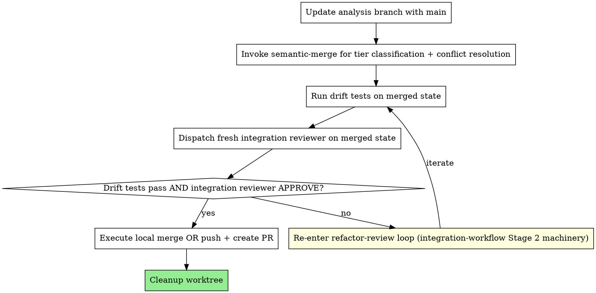

# Merge Workflow

Workflow skill for the **MERGE** phase of the superRA workflow — the final step of finishing an analysis. Owns: pulling main into the analysis branch, post-merge verification (drift tests + integration review), the refactor-review loop on post-merge failures, the actual local merge or PR push, and worktree cleanup.

This is **not** the ad-hoc merge skill. For random `git merge` / `git rebase` / `git cherry-pick` outside the analysis-finishing flow, the merge-guard hook directs callers at `superRA:semantic-merge` directly.

**Relationship to `semantic-merge`:** merge-workflow **delegates** the base-branch-into-analysis-branch update in Step 1 to `superRA:semantic-merge` via an explicit Skill invocation — you call it, wait for it to return, and then continue with Step 2. semantic-merge owns the tier classification and conflict resolution for that update; merge-workflow owns the outer choreography (post-merge drift tests + fresh integration review + refactor loop + the actual local merge or PR push + cleanup) that sits on either side of the semantic-merge call.

**Core principle:** Update with main → drift tests + integration review on the merged state → re-enter refactor-review loop on either failure → execute the actual merge or PR → clean up.

**Announce at start:** "I'm using the merge-workflow skill to integrate this work into main."

## When This Skill Runs

merge-workflow is invoked by `superRA:execution-workflow` Step 4 (Option 1 or 2) after `superRA:integration-workflow` has returned successfully. By the time this skill starts:

- Drift tests have been created, reviewed, and committed (integration-workflow Stage 1)
- Code has been refactored for codebase fit and integration-reviewer-approved (integration-workflow Stage 2)
- A work-journal report exists (integration-workflow Step 3)
- `PLAN.md` and `RESULTS.md` have been disposed of (integration-workflow Step 4)
- The user has chosen Option 1 (merge locally) or Option 2 (push + PR) — execution-workflow Step 4 captured this choice

If any of those preconditions are missing, stop and consult integration-workflow / execution-workflow rather than proceeding.

## The Process



### Step 1: Update Analysis Branch with Main

Bring the latest `main` (or whichever base branch the user is targeting) into the analysis branch by explicitly delegating to `superRA:semantic-merge`:

```
Invoke Skill `superRA:semantic-merge` with the task:
  "merge <base-branch> into <analysis-branch>"
```

This is a real Skill invocation, not a metaphor — load semantic-merge via the Skill tool and hand control to it. semantic-merge classifies conflicts by research impact (Tier 1/2/3), escalates research-meaningful decisions to the user, and uses a two-commit integration structure (mechanical resolution + integration commit). **Wait for it to return successfully** before proceeding to Step 2.

Note: the merge-guard hook may fire here reminding you to use semantic-merge. That is expected — you just did. Continue.

### Step 2: Post-Merge Verification

The merge with main may have introduced drift in your results (subtle interactions with main's code) or violated codebase conventions that have moved since integration-workflow ran. Both signals matter and both must pass before you push or merge anywhere.

**2a. Run drift tests on the merged state.**
```bash
# Use whatever the project's test runner is
pytest tests/  # or: julia --project test/runtests.jl
```
- **Pass:** drift tests still guard your results after the merge. Proceed to 2b.
- **Fail:** either the merge changed your results or the test environment moved. Skip directly to Step 3 (refactor-review loop).

**2b. Dispatch a fresh integration reviewer on the merged state.**
```
Agent(subagent_type: "reviewer"):
  Stage: integration
  Skills: superRA:refactor-and-integrate
  Domain reference: codebase-integration.md
  Code under review: <analysis paths>
  Codebase conventions: <where they live in main>
  Drift tests: <test paths>
  Diff: <merge-base>..HEAD  # the merged state vs the base branch tip
  Note: Post-merge review. Verify the merge didn't break codebase fit
        — convention drift, renamed utilities, moved files, stale imports.
```

- **APPROVE:** drift tests passed AND integration is clean. Proceed to Step 4.
- **REVISE:** integration broke during the merge. Adjudicate the reviewer's feedback per the orchestrator discipline in `superRA:execution-workflow` (Handling Reviewer Feedback). For accepted issues, proceed to Step 3.

### Step 3: Refactor-Review Loop on Post-Merge Failure

When drift tests fail OR the post-merge integration reviewer returns REVISE, re-enter the same refactor-review loop that integration-workflow Stage 2 uses. The machinery is identical — only the trigger changed.

1. **Dispatch refactorer:**
   ```
   Agent(subagent_type: "implementer"):
     Stage: refactoring
     Skills: superRA:refactor-and-integrate
     Domain reference: codebase-integration.md
     Reviewer issues to address: [accepted items, file:line, what to fix]
     Drift tests: [paths — must pass after refactoring]
     Code to refactor: [paths]
     Note: Post-merge refactoring. Main has moved since integration-workflow
           ran; address the drift introduced by the merge.
   ```

2. **After refactoring, re-run drift tests.**
   - **Pass:** commit refactored code and re-dispatch the integration reviewer (back to Step 2b).
   - **Fail with minor variation** (rounding, floating-point): update test expectation with a comment explaining the post-merge cause, commit, re-dispatch reviewer.
   - **Fail with meaningful drift** (results changed substantively): STOP. Show the user before/after values from the merge. The merge changed something material; this is not a refactoring problem — it is a research conversation. Wait for instructions.

3. **Iterate until both drift tests pass AND integration reviewer APPROVES.**

The orchestrator discipline applies: read each cited issue yourself before forwarding to the refactorer, override with documented reasoning if the reviewer is wrong, and never silently dismiss CRITICAL findings. See `superRA:execution-workflow` Handling Reviewer Feedback section for the full protocol.

### Step 4: Execute Merge or PR

Once Step 2 returns clean, execute the user's choice from execution-workflow Step 4.

**For Option 1 (Merge Locally):**

```bash
git checkout <base-branch>
git pull
git merge <analysis-branch>  # Should be fast-forward after the Step 1 update
```

Verify the pipeline still runs on the merged result:

```bash
bash run_all.sh  # or: julia pipeline.jl
```

If it fails on the merged result, something happened between Step 2 and now. Stop and investigate.

**For Option 2 (Push and Create PR):**

```bash
git push -u origin <analysis-branch>

gh pr create --title "<title>" --body "$(cat <<'EOF'
## Analysis Summary
<2-3 bullets of what was analyzed and key findings>

## Data
<Key datasets used, sample period, observation counts>

## Reproducibility
- Pipeline file: `run_all.sh` (or equivalent)
- All outputs generated from committed code
- Report: `<path-to-report>`

## Pre-Merge Quality
- Drift tests: included in `tests/` (guard key results)
- Code refactored for codebase integration
- Integration review: passed (pre-merge AND post-merge)

## Review Checklist
- [ ] Pipeline runs end-to-end
- [ ] Drift tests pass on merged state
- [ ] Data descriptions present before all analysis operations
- [ ] Row counts logged for all sample-changing operations
EOF
)"
```

### Step 5: Cleanup Worktree

If the analysis was done in a git worktree (per `superRA:using-analysis-worktrees`):

**For Options 1 and 2:**
```bash
git worktree remove <worktree-path>
```

If the analysis was done on a feature branch without a worktree, skip this step.

Report what was merged/pushed and what was cleaned up.

## Agent Teams Mode

When Agent Teams are available (`CLAUDE_CODE_EXPERIMENTAL_AGENT_TEAMS`), merge-workflow can be orchestrated as a team instead of sequential subagent dispatches. This enables direct iteration between merge-proposer/merge-reviewer and post-merge-refactorer/post-merge-integration-reviewer without the orchestrator relaying feedback.

**Invoke `superRA:agent-orchestration` for the Merge Team recipe** — it has the full team composition (4 teammates: merge-proposer, merge-reviewer, post-merge-refactorer, post-merge-integration-reviewer), the 7-task graph covering Step 1 main update through Step 3 refactor-review loop, iteration patterns, orchestrator-discipline enforcement, and cleanup protocol.

The lead still handles the user-facing meaningful-drift escalation (Step 3), executes Step 4 (local merge or PR push) outside the team, executes Step 5 (worktree cleanup) outside the team, and cleans up the team after final APPROVE. Spawn the Merge Team only after the Integration Team has been cleaned up — both share the session's team slot.

## Why Both Drift Tests AND Integration Review Post-Merge

The user explicitly accepted the cost of running BOTH signals after merging main. The reasoning:

- **Drift tests** guard your *results*. If main's changes interact with your analysis in a way that shifts a coefficient, drift tests catch it. They cannot catch convention drift (renamed utility functions, moved files, stale imports) because those don't change numerical results.
- **Integration reviewer** guards your *integration into the codebase*. If main renamed a utility you imported, drift tests still pass but the code is now stylistically broken. The integration reviewer catches it.

Together they cover both failure modes. Skipping either leaves a hole. The post-merge refactor-review loop reuses integration-workflow Stage 2 verbatim — there is no new machinery here, just a second invocation site for the same loop.

## Red Flags

**Never:**
- Push or local-merge without running BOTH drift tests AND a fresh integration reviewer on the merged state
- Silently swallow integration-reviewer REVISE on the merged state — adjudicate per the orchestrator discipline in `superRA:execution-workflow` (Handling Reviewer Feedback), then either fix or document the override
- Skip Step 1 (the semantic-merge update) and go straight to git merge — main may have moved since integration-workflow ran
- Cleanup the worktree before the merge or push has actually completed

**Always:**
- Run semantic-merge for the main update (tier classification handles conflicts properly)
- Run drift tests AND dispatch integration reviewer post-merge (both signals required)
- Re-enter the refactor-review loop on any post-merge failure
- Stop and ask the researcher via `AskUserQuestion` (plain text if unavailable) when post-merge drift indicates meaningful result changes; log the answer in `PLAN.md` per `handoff-doc` §User Decisions Log before acting on it
- Report what was merged and what was cleaned up

**Drift-test integrity on the merged state is governed by the cross-cutting rules in `refactor-and-integrate` reference `drift-test-quality.md` — failing drift tests after the main update must be adjudicated, not silently re-expected. Load the reference before running post-merge tests.**

## Integration

**Called by:**
- **superRA:execution-workflow** Step 4 (Option 1 or 2) — Directly, after dispatching `superRA:integration-workflow` first

**Invokes:**
- **superRA:semantic-merge** — REQUIRED for the main update in Step 1 (tier classification + conflict resolution)
- **superRA:integration-workflow** (via the post-merge refactor-review loop) — Reuses Stage 2 machinery for refactor + review

**Pairs with:**
- **superRA:using-analysis-worktrees** — Cleans up the worktree created by that skill
