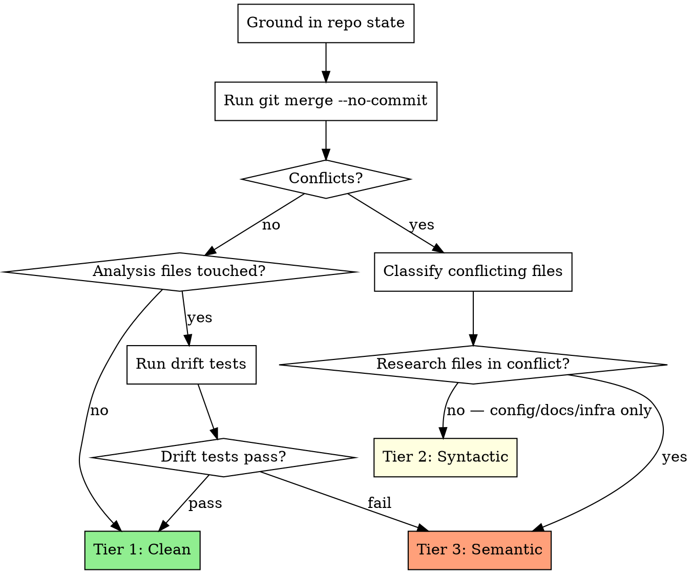

# Semantic Merge

Integrate branches by intent, not by lines. Classify conflicts by research impact, escalate research-meaningful decisions to the user, and use a two-commit structure (mechanical merge + integration commit) with subagent-driven propose+review.

Adapts the general-purpose `semantic-merge-integration` skill for economics research contexts, adding tiered classification, drift test integration, data discipline re-validation through the merge, and RA-framing human-in-the-loop decisions.

**Core principle:** Treat conflicts as intent conflicts first. Research-meaningful conflicts always go to the user. The agent implements the researcher's integration decisions — never judges methodology.

**Announce at start:** "I'm using the semantic-merge skill to integrate these branches."

## When to Use

- User asks to merge, rebase, cherry-pick, or sync branches
- `superRA:merge-workflow` Step 1 delegates to this skill to update an analysis branch from main
- Updating a long-lived analysis branch from main/upstream
- The PreToolUse `merge-guard` hook reminds you when you attempt a bare `git merge/rebase/cherry-pick` outside the analysis-finishing flow

## Invocation Pattern

semantic-merge can be invoked in two distinct ways — the mechanics are the same, but the caller and the return contract differ:

- **Standalone (ad-hoc merge).** The user asks you to merge, rebase, or cherry-pick, or the `merge-guard` PreToolUse hook fires when you attempt a bare git merge command. Load this skill directly, run the process below, and report back to the user. You own the outcome.
- **Delegated from `merge-workflow` Step 1.** The orchestrator running `merge-workflow` loads this skill via an explicit `Skill superRA:semantic-merge` invocation and hands control to it for the duration of the base-branch-into-analysis-branch update. Run the full process below, then return control to `merge-workflow` for post-merge drift tests, a fresh integration review, and the local merge or PR push. `merge-workflow` is not a passive wrapper — it owns the choreography on either side of your call.

In both cases the process below is identical. The difference is only who dispatches you and what happens after you return.

## The Process



### Step 1: Ground in Repo State

Before changing anything:

```bash
# Current state
git status
git branch --show-current
git log --oneline -5

# Merge base and incoming range
MERGE_BASE=$(git merge-base HEAD <incoming-branch>)
git log --oneline $MERGE_BASE..<incoming-branch>

# What files are touched
git diff --name-only $MERGE_BASE..<incoming-branch>
```

If the worktree is dirty, preserve it safely before merge work:
```bash
git stash push -m "pre-merge snapshot"
```

### Step 2: Classify the Merge

Test the merge without committing:

```bash
git merge --no-commit <incoming-branch>
```

**If clean (no conflicts):**
- Check if incoming changes touch analysis files (scripts, data processing, results)
- If no analysis files touched → **Tier 1** (complete the merge with `git merge --continue` or `git commit`)
- If analysis files touched → run drift tests on the merged tree
  - Drift tests pass → **Tier 1** (complete the merge)
  - Drift tests fail → abort the test merge (`git merge --abort`), proceed to **Tier 3**

**If conflicts exist:**
- Abort the test merge: `git merge --abort`
- Classify each conflicting file:

| File Type | Examples | Tier |
|-----------|----------|------|
| Analysis scripts | `.py`, `.jl`, `.R` with analysis content | 3 |
| Data processing | Variable construction, sample filters | 3 |
| Results files | Tables, figures, RESULTS.md | 3 |
| Research planning | PLAN.md | 3 |
| Drift tests | `tests/` guarding analysis results | 3 |
| Configuration | Build scripts, CI, project config | 2 |
| Infrastructure | Utility functions, shared modules | 2 |
| Documentation | README, non-results docs | 2 |
| Generated files | Compiled outputs, caches | 2 |

**Final tier = max across all conflicting files.** If any file is Tier 3, the whole merge is Tier 3.

### Tier 1: Clean Merge

No subagents needed. Execute directly.

1. Complete the merge (if `--no-commit` test merge is still staged, commit it; otherwise run a fresh merge):
   ```bash
   git merge <incoming-branch>  # or git commit if --no-commit is staged
   ```
2. Run drift tests (if they exist):
   ```bash
   # Run existing test suite
   ```
3. Run pipeline (if it exists):
   ```bash
   bash run_all.sh  # or equivalent
   ```
4. If everything passes: done.
5. If drift tests fail: abort and escalate to Tier 3.

### Tier 2: Syntactic Conflicts

Conflicts exist but none touch research-relevant files.

1. **Dispatch merge-proposer:**
   ```
   Agent(subagent_type: "superRA:implementer"):
     Stage: merge proposer
     Skills: superRA:refactor-and-integrate
     Domain reference: merge-quality.md
     Merge context: branches, merge base, tier
     Incoming changes: <commit messages and diffs since merge base>
     Conflicting files: [list with classification]
     Current branch purpose: [one line]
     Additionally: Follow the standard stage-relevant workflow and load
       relevant skills and documents to proceed. Additionally,
       <optional steering>.
   ```

2. **Proposer executes** the two-commit merge per the merge-quality.md domain reference (Commit 1 mechanical, Commit 2 integration).

3. **Dispatch merge-reviewer:**
   ```
   Agent(subagent_type: "superRA:reviewer"):
     Stage: merge
     Skills: superRA:refactor-and-integrate
     Domain reference: merge-quality.md
     Merge context: branches, merge base, tier
     Proposer's report: [integration map, decisions, rationale]
     Additionally: Follow the standard stage-relevant workflow and load
       relevant skills and documents to proceed. Additionally,
       <optional steering>.
   ```

4. **If REVISE:** adjudicate the reviewer's feedback per the orchestrator discipline in `superRA:execution-workflow` (Handling Reviewer Feedback). Forward accepted issues to the merge-proposer; push back or override others with documented reasoning. Iterate until APPROVE.

5. **Run drift tests.** If pass: done. If fail: escalate to user (Tier 3 handling).

### Tier 3: Semantic / Research Conflicts

Conflicts touch research-relevant files, or drift tests fail on a clean merge.

1. **Ground in repo state** (Step 1 above, if not already done).

2. **Understand incoming intent.** Read commit messages and diffs since merge base. Classify changes by role:
   - Research output (analysis scripts, regressions, results)
   - Data processing (merges, filters, variable construction)
   - Methodology (specifications, controls, clustering)
   - Infrastructure (utilities, shared modules)
   - Documentation (README, methodology docs)
   - Generated outputs (tables, figures)

3. **Dispatch merge-proposer** with Tier 3 context:
   ```
   Agent(subagent_type: "superRA:implementer"):
     Stage: merge proposer (Tier 3)
     Skills: superRA:refactor-and-integrate
     Domain reference: merge-quality.md
     [Tier 2 fields, plus:]
     Changes classified by research role: [list]
     Drift test results: [if available]
     Integration map with research-meaningful decisions flagged for user
     Additionally: Follow the standard stage-relevant workflow and load
       relevant skills and documents to proceed. Additionally, this is
       a Tier 3 semantic merge — research-relevant files are in conflict
       and integration decisions require user-facing flags.
   ```

4. **Present integration map to user.** The proposer's report identifies conflicts and proposes resolutions. Present research-meaningful decisions:

   ```
   Incoming changes affect research-relevant files. Integration map:

   1. [variable_construction.py] Incoming redefines `excess_return`
      from arithmetic to log returns. Your analysis uses this in
      Table 3. → REQUIRES YOUR DECISION
      Options: keep yours / adopt theirs / let me investigate

   2. [sample_filters.py] Incoming adds exclusion for firms with
      < 3 years of data. Your sample currently includes them.
      → REQUIRES YOUR DECISION
      Options: keep yours / adopt theirs / investigate impact

   3. [config.yaml] Incoming updates data paths. No research impact.
      → Will adopt incoming (auto-resolve)

   Which option for each?
   ```

5. **Execute merge** following user's decisions. Two commits:
   - Commit 1 (mechanical): resolve conflicts per user decisions
   - Commit 2 (integration): adapt remaining code to reflect the integrated intent

6. **Dispatch merge-reviewer** (`reviewer` agent + `./references/merge-quality.md`). Verify:
   - User's decisions were implemented correctly
   - No stale references to pre-merge state
   - Data discipline artifacts preserved
   - Intent from both sides is reflected

7. **If REVISE:** Proposer fixes, reviewer re-reviews.

8. **Run drift tests.** If drift tests fail after integration:
   - Present before/after values to user
   - Assess economic significance (same framework as integration-workflow)
   - **Meaningful drift:** STOP. User decides whether to accept or revise.
   - **Minor variation:** Update test expectations with documented reason.

9. **Verify pipeline** runs end-to-end on the merged result.

## Working Principles

- **Intent first.** Understand WHY each side made its changes before deciding which lines to keep.
- **Never ours/theirs blindly.** Except for generated artifacts that will be regenerated immediately.
- **Preserve user work.** Never discard dirty state or unrelated edits without explicit approval.
- **Regenerate over edit.** For generated files (tables, figures, compiled outputs), regenerate from merged source rather than hand-editing.
- **RA framing.** You propose integration, present options, and implement the researcher's decisions. You never judge whether the methodology is correct.
- **Data discipline.** If incoming changes affect data processing, verify describe-analyze-validate artifacts (row-count logs, distribution diagnostics, validation checks) are preserved in the merged result.
- **Drift tests are the safety net.** Always run them after merge. Never skip. Never silently update expectations for meaningful changes.

## When to Ask the User

These are the Tier 3 escalations for semantic-merge and the only stop points in the skill — the rest of the merge proposal/review loop runs autonomously per CLAUDE.md workflow principle #4. Use `AskUserQuestion` (plain text if unavailable) at every stop below; when the conflict has a closed set of resolutions (`--ours`, `--theirs`, synthesize, regenerate, roll back), pass them as the question options. When the decision is genuinely open-ended (methodology rewrite, sample redefinition), frame the question as free-form prose but still route it through `AskUserQuestion` if available.

**Always ask:**
- Variable definition conflicts (affects economic interpretation)
- Sample construction conflicts (changes who/what is studied)
- Econometric specification conflicts (changes the model)
- Data source changes (changes underlying facts)
- Results interpretation changes (research conclusion territory)
- Drift test failures after merge (results protection)
- Both sides imply different valid research approaches

**Do not ask** (resolve automatically):
- Infrastructure/config conflicts with no research impact
- Documentation conflicts where intent is clear from context
- Generated file conflicts (regenerate from sources)
- Formatting or style conflicts

**Present ambiguity in terms of intent and consequences**, not raw diff chunks:
- Bad: "Lines 42-58 conflict between HEAD and incoming"
- Good: "Incoming changes redefine `excess_return` from arithmetic to log returns. Your branch uses this in regression Table 3."

**Log every answer.** Each Tier 3 decision is a user decision — append it to the top-level `## Decisions` section of `PLAN.md` (if the branch still has one) using the `handoff-doc` §User Decisions Log format, and include the log entry in the integration commit that implements the resolution. If `PLAN.md` has already been disposed of, record the decision in the merge commit message instead — the commit message is the record of record once the doc is gone. The `ask-user-question-logger` hook will remind you after each `AskUserQuestion` call.

## What to Report

When the merge is complete, summarize:
- **Tier classification** and rationale
- **Incoming intent:** What the incoming changes accomplish
- **Integration decisions:** What was kept from each side, what was synthesized
- **User decisions:** What questions were asked and how the user answered
- **Drift test results:** Pass/fail with details
- **Pipeline status:** Runs or fails
- **Verification:** Stale references checked, data discipline preserved

## Agent Types and Domain References

- **`superRA:implementer`** agent + `./references/merge-quality.md` — For merge proposals
- **`superRA:reviewer`** agent + `./references/merge-quality.md` — For merge review

Stage-driven domain-skill auto-loads are defined in the `agents/implementer.md` / `agents/reviewer.md` Stage tables (for data-analysis stages, those tables auto-load `superRA:econ-data-analysis`).

## Agent Teams Mode

When Agent Teams are available (`CLAUDE_CODE_EXPERIMENTAL_AGENT_TEAMS`), the propose+review cycle can be orchestrated as a team for Tier 2 and Tier 3 merges.

**Invoke `superRA:agent-orchestration` for the Semantic Merge Team recipe** — it has the team composition (2 teammates), task graph, iteration patterns, and lead responsibilities.

The lead still handles tier classification, user-facing decisions (Tier 3 integration map), commits at each stage, and drift test verification.

## Red Flags

**Never:**
- Run bare `git merge` without tier classification in a research context
- Choose `--ours` or `--theirs` for research-relevant files without user input
- Resolve analysis-code conflicts without presenting options to the user
- Judge the researcher's methodology — you integrate, you don't evaluate (see the foundational RA framing in `CLAUDE.md`)
- Discard dirty worktree state without explicit approval

**Always:**
- Classify the merge into a tier before proceeding
- Understand incoming intent before resolving conflicts
- Use two-commit structure (mechanical + integration)
- Run drift tests after every merge
- Present research-meaningful conflicts to the user with intent and consequences
- Keep and re-validate data discipline artifacts through the merge (describe steps, row counts, validation)
- Verify pipeline runs on the merged result

**Drift-test integrity after the merge is governed by the cross-cutting rules in `refactor-and-integrate` reference `drift-test-quality.md` — failing tests after a merge must be adjudicated, not silently re-expected. Load the reference before running post-merge tests.**

## Integration

**Called by:**
- **superRA:merge-workflow** (Step 1) — Update analysis branch from base before merging back, as part of the final phase of the analysis-finishing workflow
- **PreToolUse hook** (merge-guard) — Reminds agent to use this skill for any git merge/rebase/cherry-pick

**Can invoke standalone:** User asks to merge/update branches

**Pairs with:**
- **superRA:integration-workflow** — Runs before this skill in the integration phase (creates drift tests that this skill uses as safety net)
- **superRA:agent-orchestration** — Semantic Merge Team recipe for Tier 2/3 merges

**References:**
- **semantic-merge-integration** (global skill) — General-purpose merge philosophy that this skill adapts for research
